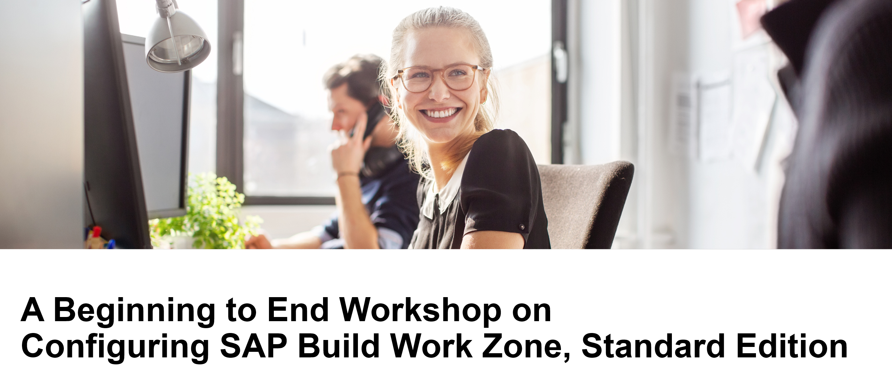

# AD280 - A Beginning to End Workshop on Configuring SAP Launchpad Service

## Description

This repository contains the material for the SAP TechEd 2022 session called Session AD280 - A Beginning to End Workshop on Configuring SAP Launchpad Service.  

## Overview

This workshop introduces attendees to the creation of a site with SAP Build Work Zone, standard edition (formerly known as SAP Launchpad service ) in their free trial account. Attendees will learn how to consume federated content from an SAP S/4HANA systems and how to add a custom developed app to the site. Finally, they will consume their site on the SAP Mobile Start app.

Before getting started with the exercises, please take a look at the following [general overview of SAP Build Work Zone](intro/overview.md).

The workshop consists of four main sections:
1. Create your first site
2. Consume SAP S/4HANA Business content in the site (this part will be shown as a demo, but you can follow the [Enhance Your SAP Launchpad Site with Federated SAP S/4HANA Content tutorial](https://developers.sap.com/mission.launchpad-s4hana.html) to consume federated content from your own SAP S/4HANA trial system. Learn more about [content federation](intro/federation.md).
3. Create your own custom developed app with the Business Application Studio and easily integrate it into your site. 
Due to time constraints, you will only create a very simple app during the workshop. Alternatively, you can also do [this advanced exercise](https://developers.sap.com/tutorials/appstudio-fioriapps-create.html) instead and create an app that consumes data from a backend system. But note that you would first need to [create an account on the SAP Gateway demo system](https://developers.sap.com/tutorials/gateway-demo-signup.html) and then [connect your BTP trial to it](https://developers.sap.com/tutorials/cp-portal-cloud-foundry-gateway-connection.html). This will take about 20 minutes longer.
4. Access your site with SAP Mobile Start.

## Requirements

This exercise is run in an SAP BTP trial environment. You need to first register to get your own free trial accoount. You can register to a trial account using this link: Create a trial account. Scroll down and click Get trial now.
For the last exercise, you will also need a mobile phone (iOS or Android) capable of running SAP Mobile Start.

## Exercises

- [Exercise 0 - Set up SAP Launchpad service in your trial account](https://developers.sap.com/tutorials/cp-portal-cloud-foundry-getting-started.html)

- Exercise 1 - Create your first launchpad site and add a URL app to the site
    - [Exercise 1.1 - Create your first site](https://developers.sap.com/tutorials/cp-portal-cloud-foundry-create-sitelaunchpad.html)
    - [Exercise 1.2 - Add an application to your site](https://developers.sap.com/tutorials/cp-portal-cloud-foundry-new-sapui5.html)

- Exercise 2 - Integrate a custom developed SAPUI5 app into your site
    - [Exercise 2.1 - Set Up SAP Business Application Studio for Development](exercise/ex2/ex2.1/readme.md)
    - [Exercise 2.2 - Create an SAP Fiori App Using SAP Business Application Studio](exercise/ex2/ex2.3/readme.md)
    - [Exercise 2.3 - Build and Deploy Your SAP Fiori App to SAP Business Technology Platform](https://developers.sap.com/tutorials/cp-portal-cloud-foundry-new-sapui5.html)
    - [Exercise 2.4 - Integrate Your SAPUI5 App into Your Launchpad Site](https://developers.sap.com/tutorials/cp-portal-cloud-foundry-create-sitelaunchpad.html)

- [Exercise 3 - Access your site with SAP Mobile Start](exercise/ex3/readme.md)

## How to obtain support

Support for the content in this repository is available during the actual time of the online session for which this content has been designed. Otherwise, you may request support via the [Issues](../../issues) tab.

## License
Copyright (c) 2022 SAP SE or an SAP affiliate company. All rights reserved. This project is licensed under the Apache Software License, version 2.0 except as noted otherwise in the [LICENSE](LICENSES/Apache-2.0.txt) file.
