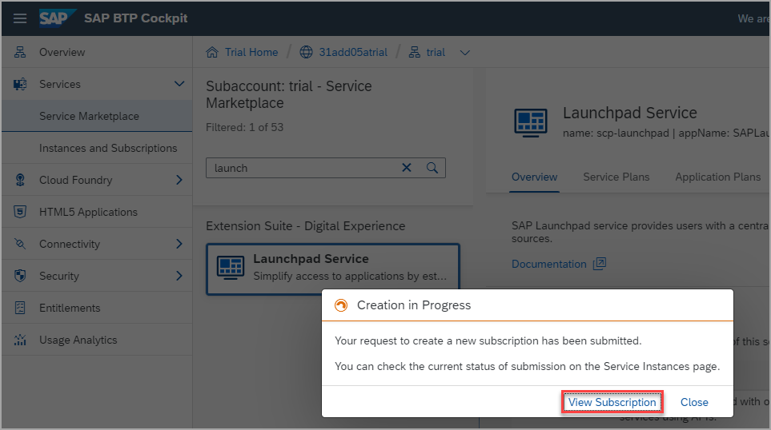

# Set Up SAP Build Work Zone, Standard Edition (former SAP Launchpad Service) Using a Trial Account

To get started with building a site in SAP Build Work Zone standard, you must perform the required onboarding steps in the SAP Business Technology Platform cockpit.

## Prerequisites
In this workshop, you will use the trial environment. If you do not have a trial account yet, you need to first register it using this link: [Create a trial account](https://www.sap.com/products/business-technology-platform/trial.html). Scroll down and click **Get trial now**.
 
Note that you can also do this tutorial using a SAP BTP free plan option. To do this, please follow this tutorial: [Set Up SAP Launchpad Service Using the Free Tier Model for SAP BTP](cp-portal-cloud-foundry-setup-freetier).

## Details
### You will learn
  - How to subscribe to the SAP Launchpad service (now called SAP Build Work Zone, standard edition)
  - How to assign yourself to the `Launchpad_Admin` role so that you can create and manage sites 
  - How to access the administration environment
  
 

### Step 1: Subscribe to the service

Before you can access and use the service, you first need to subscribe to it.

1. [Log onto SAP BTP](https://cockpit.hanatrial.ondemand.com) and click **Go To Your Trial Account**.

    

    >If this is your first time accessing your trial account, you'll have to configure your account by choosing a region (select the region closest to you). Your user profile will be set up for you automatically.
    >Wait until your account is set up and ready to go. Your global account, your subaccount, your organization, and your space are launched. This may take a couple of minutes.  

2. Click **Continue** if you get this popup.

    

3. Click the **trial** tile to navigate to your trial subaccount in the SAP BTP cockpit. If you're using your own subaccount, you can select it instead.

      
      

4. Click **Service Marketplace** in the left navigation panel.

    > The Service Marketplace provides you access to all services and applications that you can access from the SAP BTP cockpit.

    
    

5. Enter `launchpad` in the search box and click the **Launchpad Service** tile.

    

    >If you aren't able to find the **Launchpad Service** tile, or if you can't access it, you may be using an older trial account. You can easily add it to your account via the **Entitlements** area. Click **Configure Entitlements** and then **Add Service Plans**. Then search for `launchpad`, check the standard (applications) plan, and click **Add 1 Service Plan**. Don't forget to save in the next screen.

    The Launchpad Service page opens with 3 tabs that include information about the service as well as the two different plans.
    

6.  Click the **Create** button at the top right of the screen.

    

    

7. In the **New Instance or Subscription** dialog box that opens, select the **standard (Subscription)** plan from the drop-down list and click **Create**.

    
    
    >There are two types of standard plans available. In this case, you need to create a *subscription* to the SAP Launchpad service. 
    

8. You will get a confirmation that your subscription is being created. Click **View Subscription**.

    

    >This step will redirect you to the **Services** -> **Instances and Subscriptions** screen. This screen provides you with an overview of all services and applications that are currently active.
    

9. From the **Instances and Subscriptions** screen, under the **Subscriptions** tab, or on the right under the service name, wait until see that you are subscribed to the **Launchpad Service**.

    

### Step 2: Add yourself to the Launchpad_Admin role

To be able to access the SAP Launchpad service, users must be assigned to the `Launchpad_Admin` role. In this step, you'll assign yourself to this role so that you can access the service and create a launchpad site.

1. Click **Role Collections** from the side menu.

      
      

2. In the Search field start typing Launchpad to find the `Launchpad_Admin` role collection.

    
    

3. In the row with the `Launchpad_Admin` role collection, click the arrow at the far right of the row.

    

    You can see all the details of the `Launchpad_Admin` role collection.
    
    > You could also click on the role collection name to open its details.
    

4. Click **Edit**

    
    

5. Under the **Users** tab, enter your email in both the **ID** and the **E-Mail** fields. Then click **Save**.

    

You've now been assigned to the `Launchpad_Admin` role collection and you can access SAP Build Work Zone and carry out all your admin tasks.

### Step 3: Access the SAP Build Work Zone standard

1. From the side panel, click **Instances and Subscriptions**.

    
    

2. Under the **Subscriptions** tab, click the **Launchpad Service**.  You can also click **Go to Application** on the right.

    

   The service opens with the Site Directory in focus. This is where you'll create and manage your sites.
   
   > It may take a few minutes for the admin role assignment to take effect.  If you get an **Access Denied** error, please try to access the admin environment in an anonymous window or logout and login again.

  

## Summary

You have now created a subscription to SAP Build Work Zone, standard edition, and assigned yourself the administrator role. 
Continue to - [Exercise 1.1 - Create your first site ](../ex1/ex1.1/README.md)
