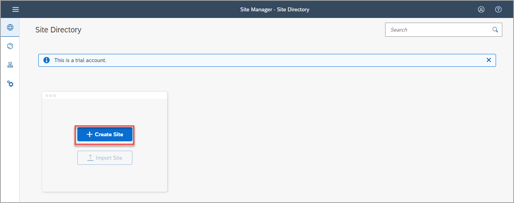
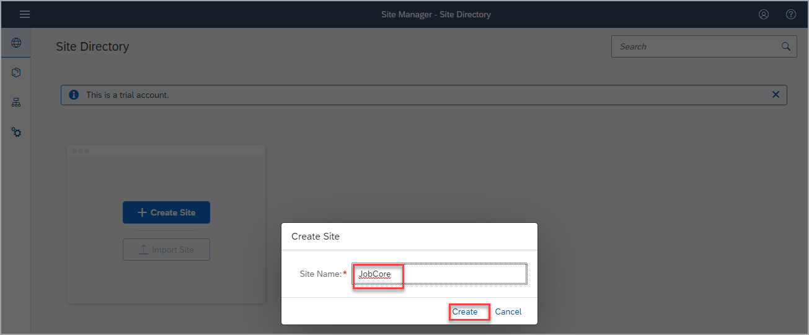
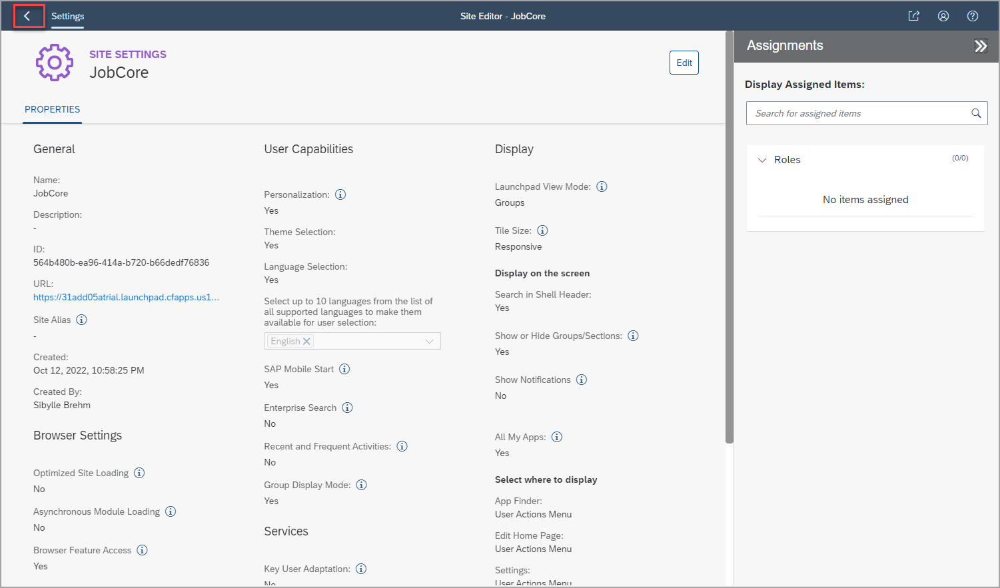

# Create a site with SAP Build Work Zone, standard edition

In this tutorial you will create a site for a recruiting company called `JobCore`. You will then a add business app to this site.

## Prerequisites
You have subscribed to the SAP Launchpad service and assigned yourself to the `Launchpad_Admin` role.

 

### Step 1: Create a site

When you access the admin environment, the Site Directory is in focus. From here you will create your new site.

> In the side panel of the admin environment, you see four tools. The **Site Directory** where you are going to create a new site. All sites that you create will be displayed here. The **Content Manager** where you will manage cross-site content such as business apps. The **Channel Manager** where you manage different channels that expose business content that you can integrate into your sites. The fourth icon opens **Settings** where you can configure various settings related to SAP Build Work Zone, standard edition.

1. Click **Create Site**.

    

2. Enter `JobCore` as the site name and click **Create**.

    

You've just created a site called `JobCore`.

 

### Step 2: Navigate to the Site Directory

When you create a site, you are directed to the **Site Settings** screen where you can edit the site settings and assign roles to the site. 

> In the site settings, you can configure various site capabilities, e.g. integration with SAP Mobile Start, Enterprise Search. You can enable Key User Adaptation and define with options users should have, e.g. if users are able to personalize the site or select a theme or a language.

Navigate back to the **Site Directory** to view the site tile.

  

 

## Summary

You have created your first site. For now, the site is empty.

Continue to - [Exercise 1.2 - Add an app to your site](../ex1.2/README.md) to add a business app to your site.

