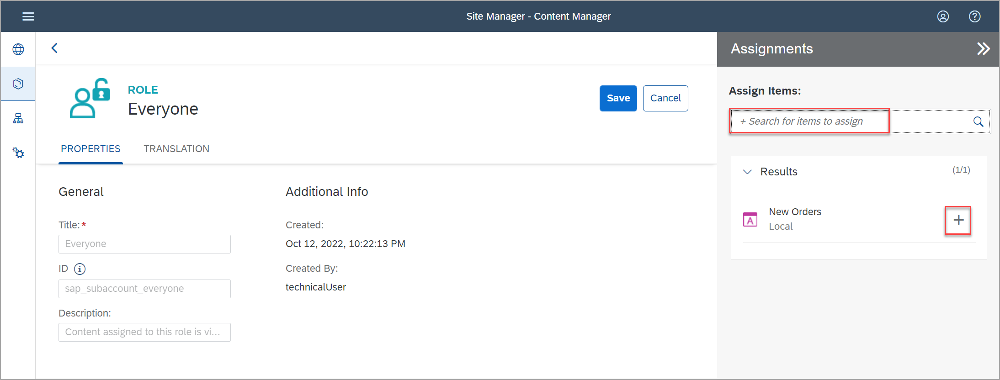

# Add an SAPUI5 App to Your Site

In this exercise , you will use the **Content Manager** to add an SAPUI5 app to your  site. You will also create a group and assing the app to it.

## Prerequisites
 - You've already created the `JobCore` site.  

 

## Step 1: Open Content Manager

 Click the Content Manager icon in the side panel to open the **Content Manager**.

>The **Content Manager** has two tabs: **My Content** where you can manually configure content items and view any other available content items, and the **Content Explorer** where you can explore exposed content from available channels, select the content, and add it to your own content.

  
  
  > If you want, you can click the *Expand* icon  to see the names of the menu entries in addition to the icons.

 

### Step 2: Create and configure new app

1.  Click **+ New** and select **App** from the list.  

    

    The app editor opens with the **PROPERTIES** tab in focus.

2. Enter the following values:

    * **Title**: `New Orders`

    * **Open App**: In place

    * **URL**:  `https://sapui5.hana.ondemand.com/test-resources/sap/m/demokit/cart/webapp/index.html`

    

    >When working in your own environment, it's better to integrate SAPUI5 apps using the HTML5 apps repository. This configuration allows you to better manage your content in the Dev-QA-Prod lifecycle. You will see how to do this in exercise 2.

3. Click the **NAVIGATION** tab to specify the intent of your app.

    > The unique combination of a semantic object and an action is called an intent. It is used to define navigation to an application.

4. Enter the following values:

    * **Semantic Object**: `Order`

    * **Action**: `Display`

    

5. Click the **VISUALIZATION** tab.

    In this tab, you specify how the app will be displayed in the launchpad site.

6. Enter the following values:

      * **Subtitle**: `Shopping Cart `

      * **Information**:  `Order Now!`

      * **Icon**: Click the browse icon, type `my-sales-order`, click on the displayed icon, and click **OK**.

      On the right, you can see a preview of the tile with all the properties you entered.
      Click **Save**.

    

 

### Step 3: View the app that you created

Click the **Back** icon to navigate back to the *Content Manager*. You could also click the Content Manager icon in the left side panel.

  

You can see your app in the list of content items:

For end users to access the app in runtime, you must assign the app to a role. You also need to assign the app to a group so that it is visible in the site.

This is described in the following steps.

 

### Step 4: Assign the app to the Everyone role

>Content assigned to the `Everyone` role is visible to all users. In addition, the `Everyone` role is by default assigned to every site, so that you do not need to assign the role to the site to make its content available.

1. Click the **Everyone** role.

    

2. Click **Edit**.

    

3. Click the search box in the **Assignments** panel on the right. Any available apps are shown in the list below.

    >If you have many apps, you can type some letters of your app name in the search bar, (for example, `Or`) to search for the app.

4. In the **Results** list, click the **+** icon next to the `New Orders` app to assign this role to your app.

    

    You will see that the icon changes.

5. Click **Save**.

    
    
6. Click the **Back** icon to navigate back to the *Content Manager*. 

 

### Step 5: Create a group and assign the app to it

>A group is a set of one or more apps displayed together in a launchpad site.
 Assigning apps to groups, makes them visible to the user.
   

1. Click **+ New** and select **Group** to create a group.

    

2. Enter `Purchasing` as the **Title** and in the **Assignments** panel, click inside the search box on the right of the screen, to show all available apps. You should see `New Orders`.

3. In the **Results** list, click **+** to assign the `New Orders` app to your group.

    

4. Click **Save**.

    

 

### Step 6: Review the site

1. Click the Site Directory icon in the left panel to open the **Site Directory**.

    

2. On the `JobCore` tile, click the **Go to site** icon.

    

3. This is what you will see:

    

    Your `New Orders` app is displayed in the `Purchasing` group.
    

4. Click the `New Orders` tile to launch the app. 

   

In the app, click on the any categories on the left to view product offerings.

 

## Summary

You have successfully added an app to your site. 

Continue to - [Exercise 2.1 - Set Up SAP Business Application Studio for Development](../../ex2/ex2.1/README.md) to start building a simple app that you will then add to your site.

