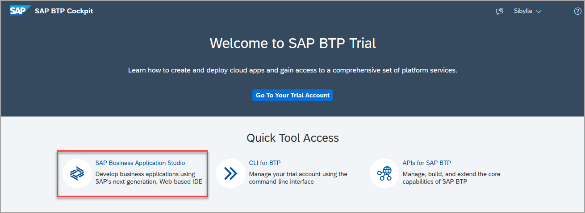
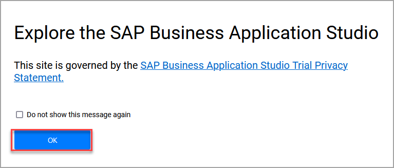
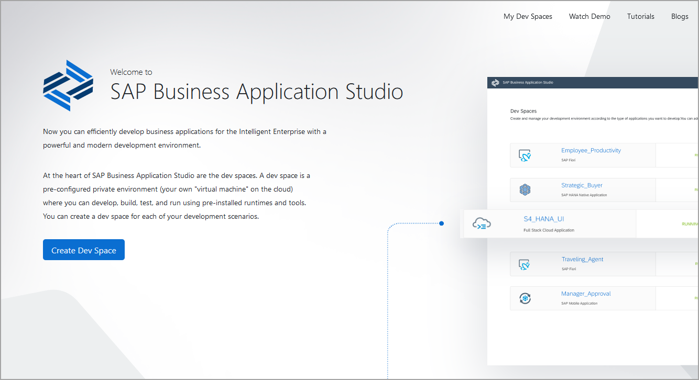
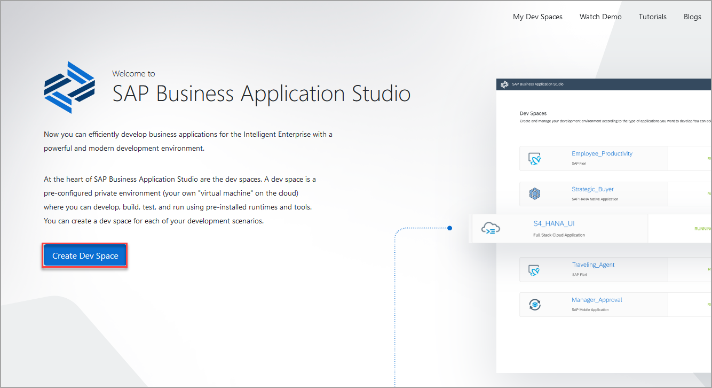
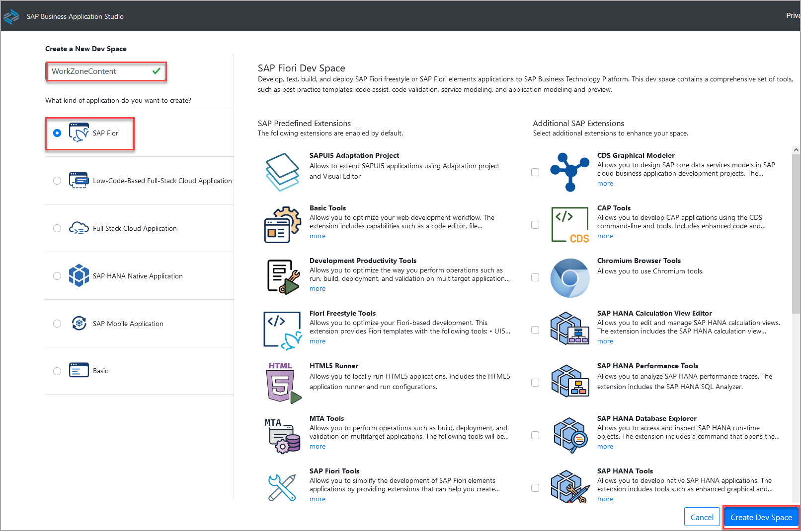
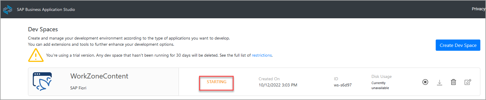
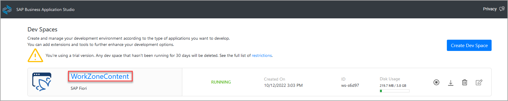
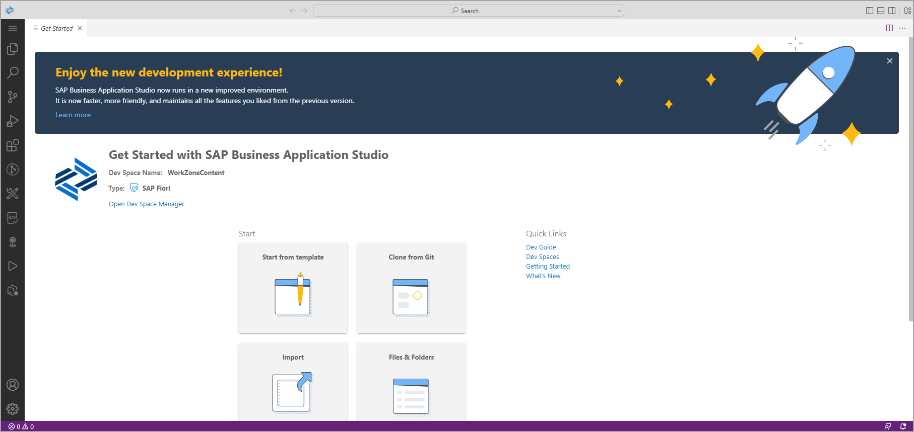

# Exercise 2.1: Set Up SAP Business Application Studio for Development

SAP Business Application Studio is a development environment available on SAP Business Technology Platform. In recent trial accounts, the SAP Business Application Studio is subscribed to by default, so you can directly launch it and create your first Dev Space.

### Step 1: Launch SAP Business Application Studio

1. Open the [SAP BTP Trial Start page](https://account.hanatrial.ondemand.com) and login if required. 
2. Click **SAP Business Application Studio** to launch SAP Business Application Studio.

    

    >If you receive an error message and your recently created account was created with error, it is recommended that you re-create your account: delete the account and then [Get a Free Account on SAP BTP Trial](hcp-create-trial-account).

    >**CAUTION:** If you receive an error message and your account was not created recently, you need to add a subscription to SAP Business Application Studio. Answer the validation question of the current step, go to the next step in this tutorial, and proceed from there.

2. You might see a pop-up about the Trial Privacy Statement. Confirm with **OK**.

    

3. A new tab opens. If you have not created a dev space, the welcome page for SAP Business Application Studio loads. 

    
 

### Step 2: Create a Dev Space

1. On the Welcome page, click **Create Dev Space**.

 
 
2. In the *Create a New Dev Space* screen, enter **WorkZoneContent** as name for your new workspace. Select **SAP Fiori** as the type of application you want to create. Then click **Create Dev Space**.

 
 
 > The dev space is in status **STARTING**. Wait until it is in status **RUNNING**. This might take a couple of minutes.

 
 
  
 
 ### Step 3: Enter the Dev Space
 
 1. When the status has changed to **RUNNING**, click the name of the dev space **WorkZoneContent**.
 
 
 
 2. The dev space opens and the *Get Started* tab appears.

 
 
 

## Summary

You have successfully accessed SAP Business Application Studio and created a Dev Space.

Continue to - [Exercise 2.2 - Create an SAP Fiori App Using SAP Business Application Studio](../ex2.2/README.md).

