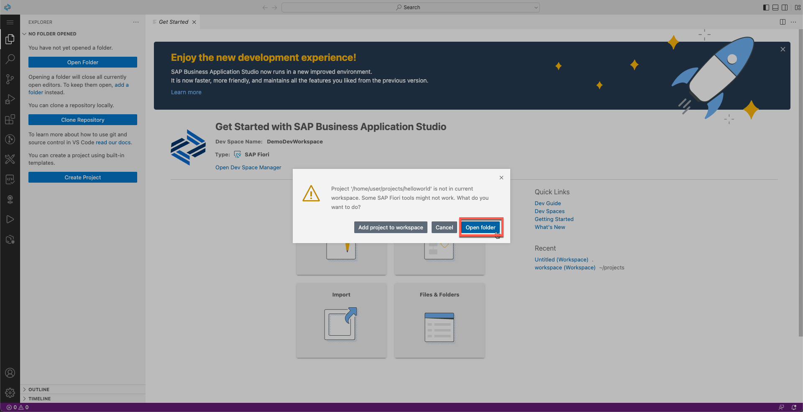

# Exercise 2.2 - Create an SAP Fiori App Using SAP Business Application Studio

In this exercise, you will develop a simple SAPUI5 freestyle application, adhering to SAP Fiori design guidelines. 

 

### Step 1: Create an SAPUI5 app from a template

Using the app creation wizard you can at any point click the Back button to go back to the previous step, or click a specific wizard step to go back to that step.

1. In the *Get Started* tab click **Start from template**.

   

2. Select the **SAP Fiori Application** tile, and click **Start**.

   

3. In the *Template Selection* screen, select *Application Type* **SAPUI5 freestyle** from the drop-down

   

4. Select the template **SAPUI5 Appliction** to choose a basic empty UI Application and click **Next**. 

   
   
5. For *Data Source and Service Selection*, select **None** from the drop-down as for this simple app, you will not consume any data from a backend system. Then click **Next**.

   

6. In the next step, you can choose a name of the default UI5 view that would be generated. You can simply keep View1 here and click **Next**.

   

7. Select the following **Project Attributes**, then click **Next**.

    | Step | Parameter | Value |
    |:-----|:----------|:------|
    | A | Module name | **`helloworld`** |
    | B | Application title | **Hello World** |
    | C | Application namespace | **teched** |
    | D | Description | **SAPUI5 freestyle application** |
    | E | Project folder path | **`/home/user/projects`** (default)|
    | F | Minimum SAPUI5 version | **1.102.1** (default) |
    | G | Add deployment configuration | **Yes**|
    | H | Add FLP configuration | **Yes** |
    | I | Configure advanced options | **No** (default) |

   
    
7. For **Deployment Configuration**, select **Cloud Foundry** from target drop-down and let the *Destination Name* as **None** which is default. Click **Next**. Select the **Yes** radio-button for the last input `Add Application to managed application router?`

   

8. Finally, in the **Fiori Launchpad Configuration** screen, select the following, and click **Finish**. 

    | Step | Parameter | Value |
    |:-----|:----------|:------|
    | A | Semantic Object | **helloworld** |
    | B | Action | **display** |
    | B | Title | **My Hello World** |
    | B | Subtitle (optional) | **Custom UI5 App** |

    

9. Wait until the installation of project dependencies is completed. A notification that "The project has been generated" appears at the bottom right of the screen. You would get a popup as shown below. Select **open folder** to see the generated Project folder structure in the workspace.
    
    
    
 In case this takes longer or the popup doesn't appear, you can also open the folder from the left panel **Open Folder** and selecting the folder path as `/home/user/projects/` and choose **helloworld** from the drop down.

 

### Step 4: Run the App Locally in the Dev Space

To test your app, you can now run it locally within SAP Business Application Studio.

1.	In the left *Explorer* panel, right-click on the **webapp** folder and select **Preview Application** from the context menu.

    

2.	Select the first entry **`Start fiori run...`** to run the app locally in a sandbox launchpad shell.

    

3. A new browser tab opens showing a folder structure. Select the **test/** folder.

    >If your browser does not allow opening a new tab, you may see a message in the upper left corner with a link where you can allow opening a new tab.

    

4. In the **text** folder you can now select **flpSandbox.html**. 
   
   

5. This will open the launchpad sandbox, where you can see the tile with title **Hello World**. Click on this tile.
   
   

6. You should now see the application with header titlew as *Hello World*. You don't see any other content since we did not add any other UI elements to the content area.

   
   
 

## Summary

You've now created a simple app. In the next exercise you will build the app and deploy it to Cloud Foundry.

Continue to - [Exercise 2.3 - Build and Deploy your application ](../ex2.3/README.md)
