# Exercise 2.2 - Create an SAP Fiori App Using SAP Business Application Studio

In this exercise, you will develop a simple SAPUI5 freestyle application, adhering to SAP Fiori design guidelines. The flow consists of two parts:

1. Running a wizard that creates a multi-target application (MTA) project that is configured to use Managed Application Router. An MTA is required in order to create the deployment artifact for SAP BTP, Cloud Foundry environment. If you are not familiar with the MTA concepts, read this [guide](https://www.sap.com/documents/2016/06/e2f618e4-757c-0010-82c7-eda71af511fa.html). Creating the MTA project upfront does not take long and will allow you to save time later in the exercise.

2. Creating an SAPUI5 app from a template within this project and preview it.

 

### Step 1: Create new Multitarget Application project

1. The search window at the top-center of the SAP Business Application Studio window allows users to easily search for files, folders, or commands. To search for a command put a **>** into the search field. Alternatively, you could use the menu icon on the top left to access the command palette.

    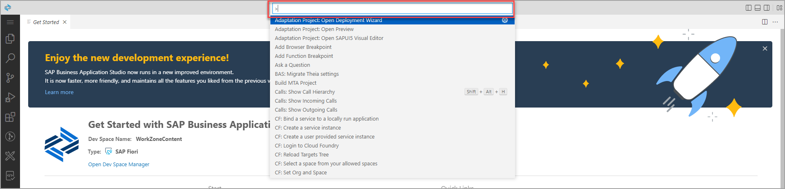

2.  Type `fiori: open` in the search field and select the **Fiori: Open CF Application Router Generator** command.

    

4. The **Application Router Generator Wizard** tab is opened. For **Application Router Configuration**, select the following, and click **Finish**.

    | Step | Parameter | Value |
    |:-----|:----------|:------|
    | A | Application router project path | **/home/user/projects** (default) |
    | B | MTA ID | **`FioriDemo`** |
    | C | MTA Description | Can be left empty (default) |
    | D | Add route module | **Managed Approuter** |

    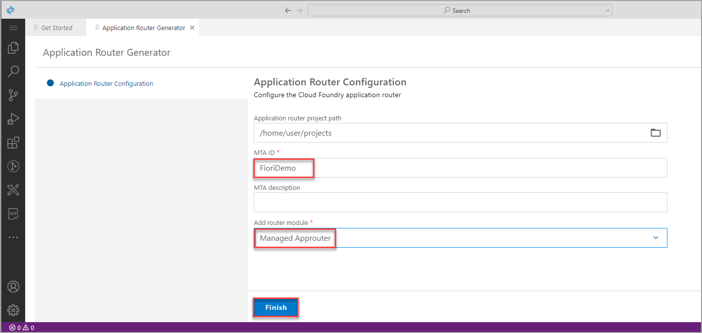

    >When end-users access an app in the Cloud Foundry environment, they actually access the Application Router first. The application router is used to serve static content, authenticate users, rewrite URLs, and forward or proxy requests to other micro services while propagating user information.

    >The recommendation is to use **Managed Application Router** that provides many benefits, when compared to Standalone Application Router, such as save resources, lower maintenance efforts, etc. Standalone Application Router should only be used in advanced cases, for example when application router extensibility is required. More information is available in [Developing HTML5 Applications in the Cloud Foundry Environment](https://help.sap.com/viewer/65de2977205c403bbc107264b8eccf4b/Cloud/en-US/11d77aa154f64c2e83cc9652a78bb985.html)

5. Wait until the creation of project is completed. A notification that "The files have been generated" appears at the bottom right of the screen.

    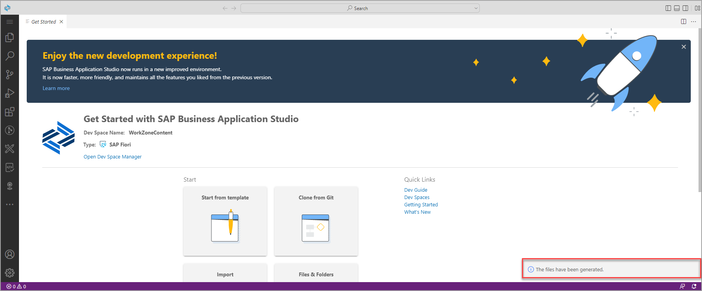

 

### Step 2: Add your folder to a workspace

Your workspace is an entity containing your project's settings, debug configurations, and task configurations. You can choose to create a new workspace or for each project or you can set up a multi-root environment that holds several projects. You can find out more about **Workspaces** in the SAP Business Application Studio [documentation](https://help.sap.com/viewer/9d1db9835307451daa8c930fbd9ab264/Cloud/en-US/0919ce1ca4a342628e49c0f5e9c8cdcf.html).

1. Click the menu icon and select **File | Add Folder to Workspace...** to open the **Add Folder to Workspace** dialog.

    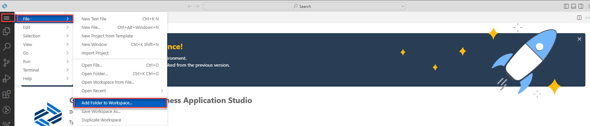

2. The **Add Folder to Workspace** dialog is opened at the center of the SAP Business Application Studio window. Select the **projects** folder. 

    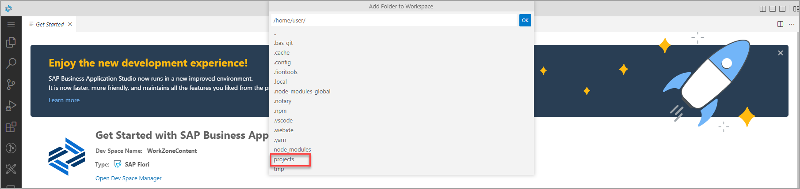
   
3. Now select the **`FioriDemo`** project and click **OK**.

    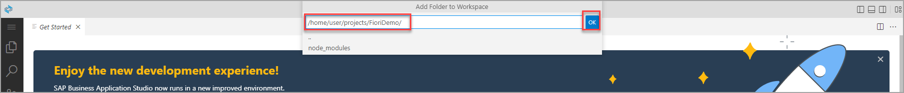

3. SAP Business Application Studio reloads with the `FioriDemo` project open in a yet untitled workspace. In the Explorer view you can see the `FioriDemo` project, its folder structure, and files.

    >The status bar color changes to blue, indicating that a workspace is open.

    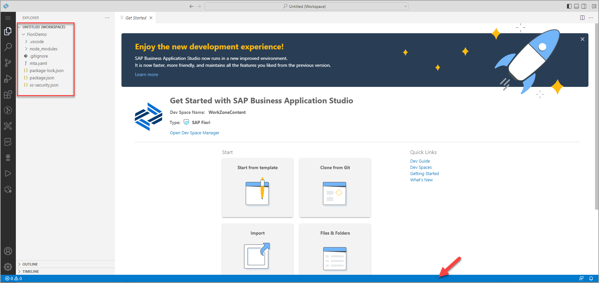

 

## Step 3: Create an SAPUI5 app from a template

Using the app creation wizard you can at any point click the Back button to go back to the previous step, or click a specific wizard step to go back to that step.

1. In the *Get Started* tab click **Start from template**.

2. Select the **SAP Fiori Application** tile, and click **Start**.

3. For *Template Selection*, select *Application Type* **SAPUI5 freestyle** from the drop-down, then select the template **SAPUI5 Appliction** and click **Next**.

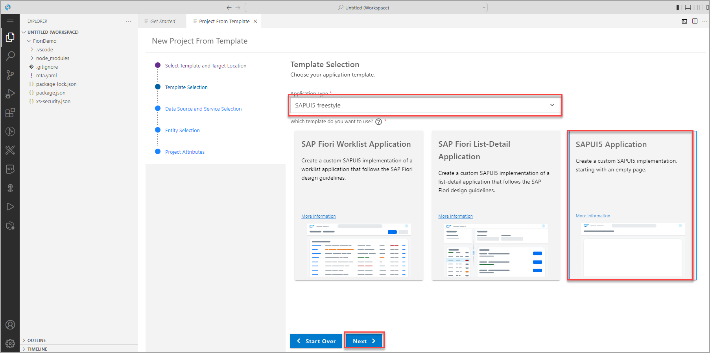

4. For *Data Source and Service Selection*, select **None** from the drop-down as for this simple app, you will not consume any data from a backend system. Then click **Next**.

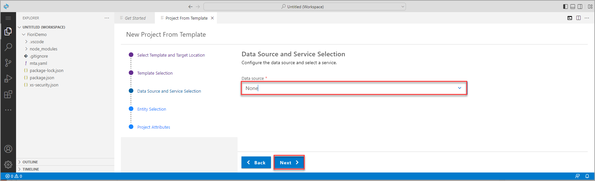

5. In the next step, you can change the name of the view. You can simply keep View1 here and click **Next**.

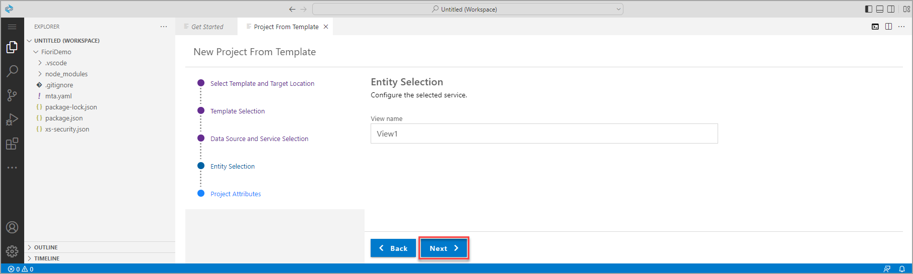

6. For **Project Attributes**, select the following, and click **Next**.

    | Step | Parameter | Value |
    |:-----|:----------|:------|
    | A | Module name | **`helloworld`** |
    | B | Application title | **Hello World** |
    | C | Application namespace | **teched** |
    | D | Description | **An empty SAPUI5 freestyle app** |
    | E | Project folder path | **`/home/user/projects/FioriDemo`** (default)|
    | F | Minimum SAPUI5 version | **1.102.1** (default) |
    | G | Add deployment configuration | **Yes** (default)|
    | H | Add FLP configuration | **Yes** |
    | I | Configure advanced options | **No** (default) |

    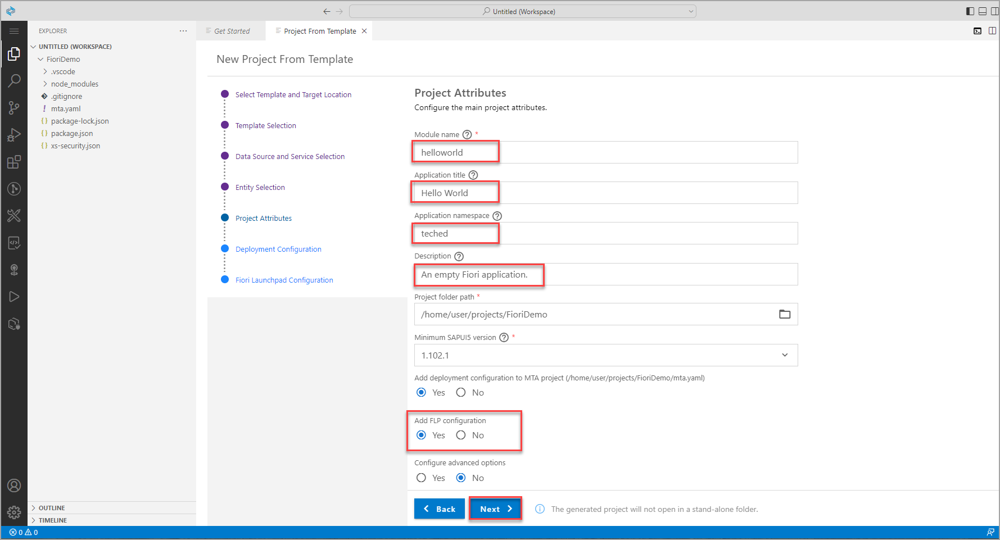
    
7. For **Deployment Configuration**, keep the defaults **Cloud Foundry** and *Destination Name* **None**. Click **Next**.

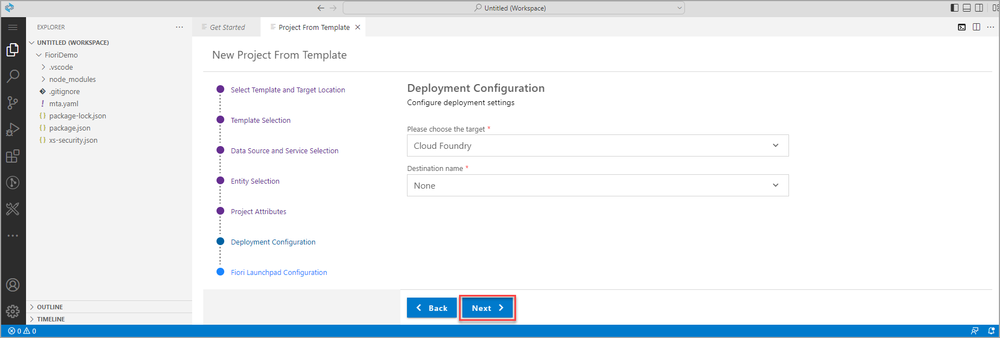

8. Finally, for **Fiori Launchpad Configuration**, select the following, and click **Finish**.

    | Step | Parameter | Value |
    |:-----|:----------|:------|
    | A | Semantic Object | **helloworld** |
    | B | Action | **display** |
    | B | Title | **My Hello World** |
    | B | Subtitle (optional) | Add a subtitle of your choice |

    

9. Wait until the installation of project dependencies is completed. A notification that "The project has been generated" appears at the bottom right of the screen, The **Application Information** tab is opened, and the files and project structure in the **Explorer** view are updated.
    
    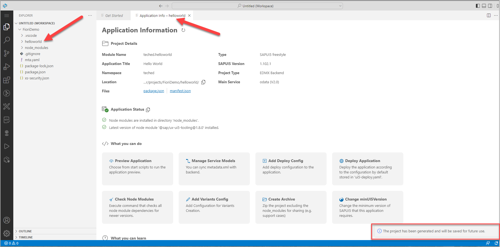

 

### Step 4: Run the App Locally in the Dev Space

To test your app, you can now run it locally within SAP Business Application Studio.

1.	Click the **Run Configurations** view button to open the `Run Configurations` view. A set of run configuration that were created as part of the app generation are presented.

    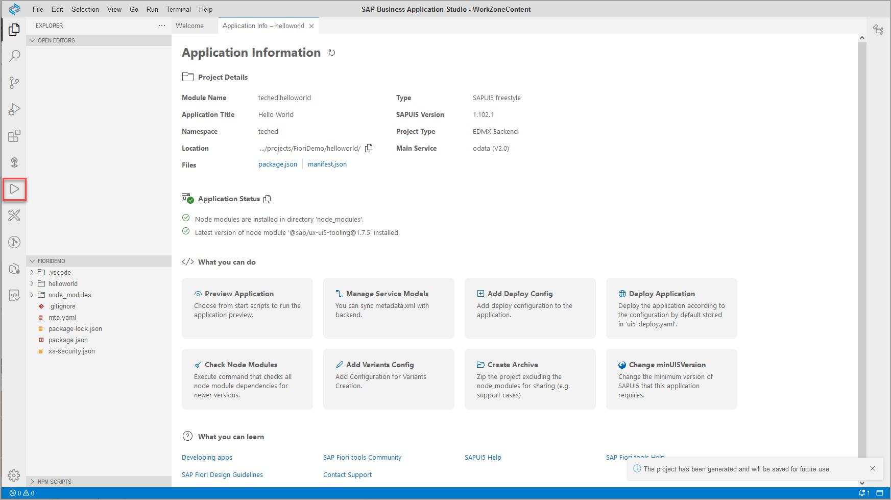

2.	Click the **Play** icon of the **`Start helloworld`** run configuration to run the app locally in the dev space.

    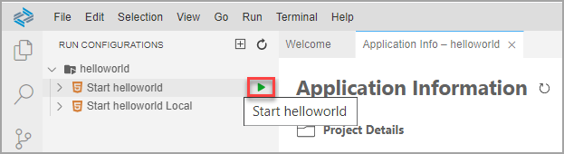

    >The **Debug** view opens, and the status bar color changes to orange, indicating that a debug session is in progress.

    >A new tab opens in SAP Business Application Studio where you can see the log of the running app.

    >You may be prompted to allow pop-ups or open the app in a new tab.

    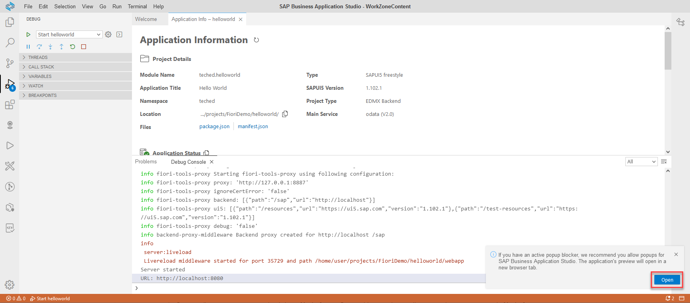

3. A new browser tab opens showing the app. In this stage of the development, the app only shows a title.

    >If the browser tab does not open, or a notification "You have exceeded the number of ports you can expose" appears at the bottom-right of the page, you may need to un-expose ports. Select the **Ports: `Unexpose`** option in the command palette (View | Find Command) to un-expose a port that is in an **[Active]** state. Repeat this procedure until no more than two ports are in **[Active]** state, and try again.

    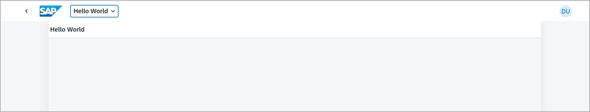

 

## Summary

You've now created a simple app. In the next exercise you will build the app and deploy it to Cloud Foundry.

Continue to - [Exercise 2.3 - Build and Deploy your application ](../ex2.3/README.md)
