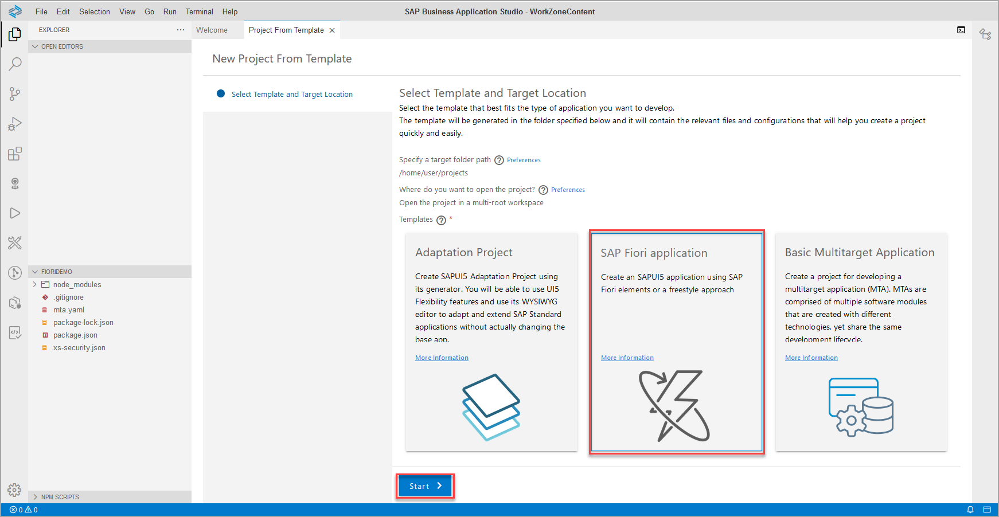
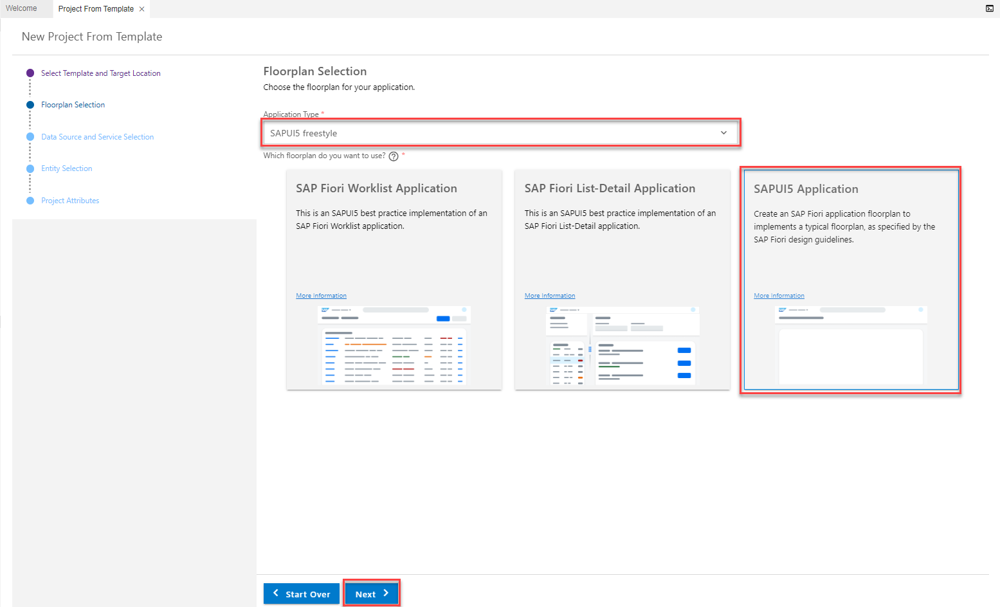
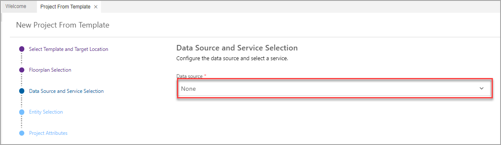
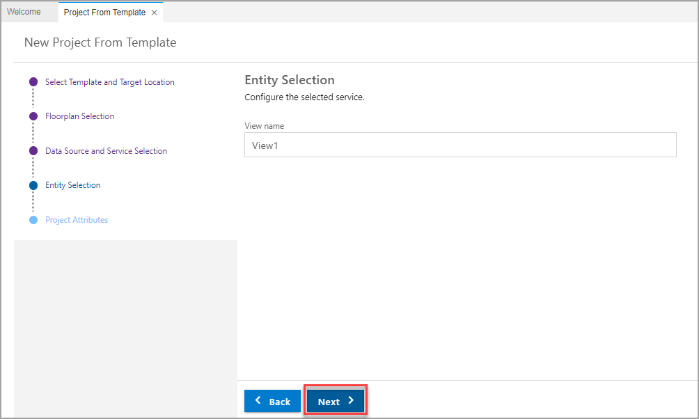
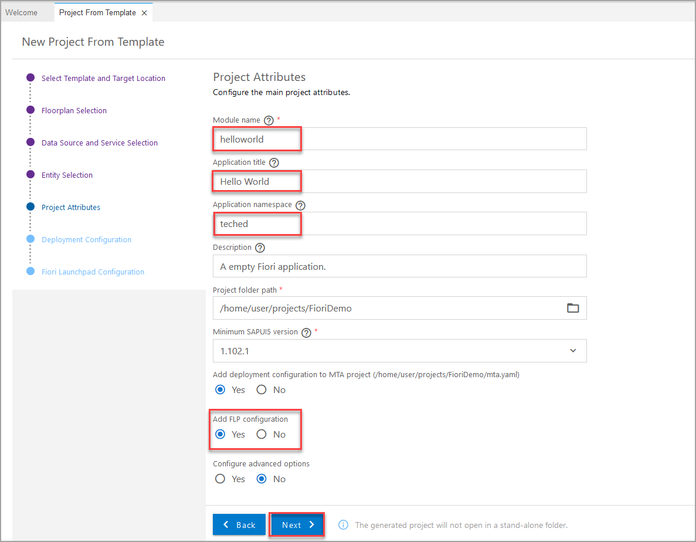
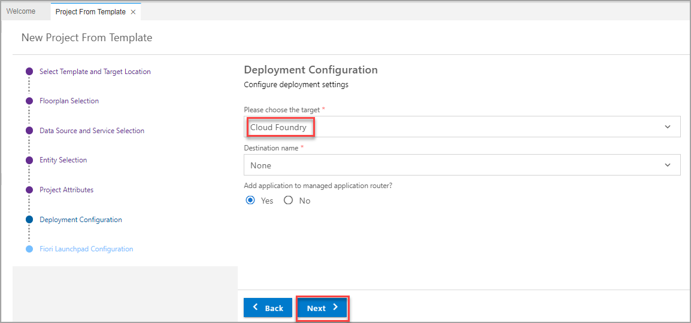
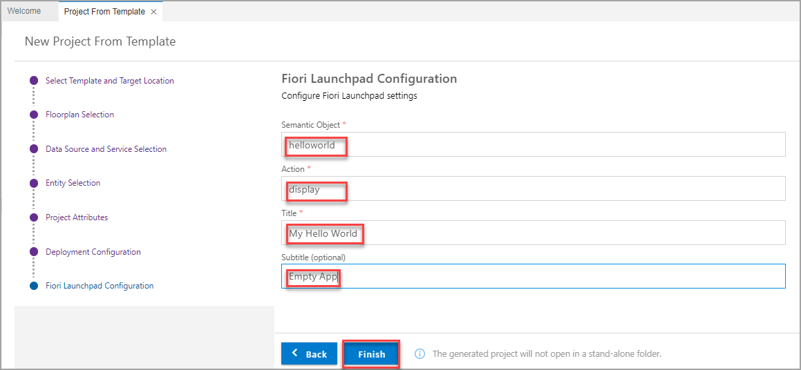
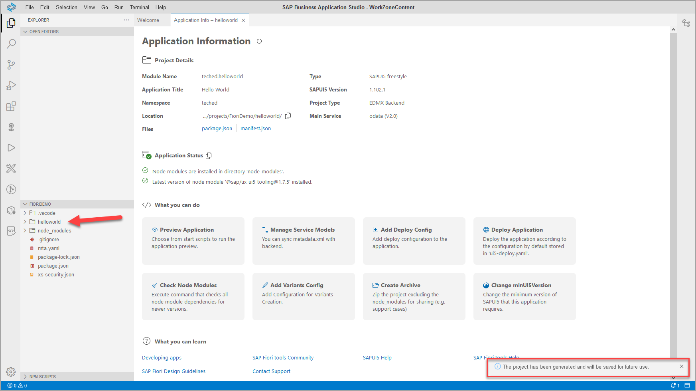

# Exercise 2.2 - Create an SAP Fiori App Using SAP Business Application Studio

In this exercise, you will develop a simple SAPUI5 freestyle application, adhering to SAP Fiori design guidelines. The flow consists of two parts:

 

### Step 1: Connect to your CF account to which you want to deploy the application

> In this step, you will login to your SAP BTP trial account from SAP Business Application Studio, as you will deploy the app to this subaccount once you have finished creating it.

1. Switch to the SAP BTP cockpit and click on **Overview** of your subaccount (top left).

    

Keep this information in mind for the next steps (this is especially important if you want to use multiple subaccounts for your SAP Business Application Studio).

2. Go back to the **SAP Business Application Studio**.

3. Click the **menu** icon on the top left of the screen to open the menu and select **View > Command Palette** to get access to the available commands.

    

4.  Enter "Lo" into the Search field, then select the command **CF: Login to Cloud Foundry**.

    

5. In the **Sign in screen** make sure that the right **API end point** is selected. Then enter your **user ID** and **password**. Then click the *Sign in** button.

    

6. From the drop-down list of availabl organization in the Cloud Foundry end point, select your trial account and the space to which you want to deploy the application. 
7. There is one space called **dev** available by default in SAP BTP trial accounts.

    

 

You can see that the organization and space have been set. 

8. Click the **Get started** tab to go back to the start page.

    
    
     

## Step 2: Create an SAPUI5 app from a template

2. In the *Get Started* tab click **Start from template**.

> Using the UI wizard you can at any point click the *Back* button to go back to the previous step, or click the specific wizard step to go back to that step.

3. Select the **SAP Fiori Application** tile, and click **Start**.

4. For *Floorplan Selection*, select *Application Type* **SAPUI5 freestyle** from the drop-down, then select the floorplan **SAPUI5 Appliction** and click **Next**.

4. For *Data Source and Service Selection*, select **None** from the drop-down as for this simple app, you will not consume any data from a backend system. Then click **Next**.

5. In the next step, you can change the name of the view. You can simply keep View1 here and click **Next**.

6. For **Project Attributes**, select the following, and click **Next**.

    | Step | Parameter | Value |
    |:-----|:----------|:------|
    | A | Module name | **`helloworld`** |
    | B | Application title | **Hello World** |
    | C | Application namespace | **teched** |
    | D | Description | **An empty SAPUI5 freestyle app** |
    | E | Project folder path | **`/home/user/projects/FioriDemo`** (default)|
    | F | Minimum SAPUI5 version | **1.102.1** (default) |
    | G | Add deployment configuration | **Yes** (default)|
    | H | Add FLP configuration | **Yes** |
    | I | Configure advanced options | **No** (default) |

    
    
7. For **Deployment Configuration**, keep the defaults **Cloud Foundry** and *Destination Name* **None** and **Yes** for using the managed app router, as you will not use a backend system for consuming data. Click **Next**.

8. Finally, for **Fiori Launchpad Configuration**, select the following, and click **Finish**.

    | Step | Parameter | Value |
    |:-----|:----------|:------|
    | A | Semantic Object | **helloworld** |
    | B | Action | **display** |
    | B | Title | **My Hello World** |
    | B | Subtitle (optional) | Add a subtitle of your choice |

    

9. Wait until the installation of project dependencies is completed. A notification that "The project has been generated" appears at the bottom right of the screen, The **Application Information** tab is opened, and the files and project structure in the **Explorer** view are updated.
    
    

 

### Step 4: Run the App Locally in the Dev Space

To test your app, you can now run it locally within SAP Business Application Studio.

1.	Click the **Run Configurations** view button to open the `Run Configurations` view. A set of run configuration that were created as part of the app generation are presented.

    

2.	Click the **Play** icon of the **`Start helloworld`** run configuration to run the app locally in the dev space.

    

    >The **Debug** view opens, and the status bar color changes to orange, indicating that a debug session is in progress.

    >A new tab opens in SAP Business Application Studio where you can see the log of the running app.

    >You may be prompted to allow pop-ups or open the app in a new tab.

    

3. A new browser tab opens showing the app. In this stage of the development, the app only shows a title.

    >If the browser tab does not open, or a notification "You have exceeded the number of ports you can expose" appears at the bottom-right of the page, you may need to un-expose ports. Select the **Ports: `Unexpose`** option in the command palette (View | Find Command) to un-expose a port that is in an **[Active]** state. Repeat this procedure until no more than two ports are in **[Active]** state, and try again.

    

 

## Summary

You've now created a simple app. In the next exercise you will build the app and deploy it to Cloud Foundry.

Continue to - [Exercise 2.3 - Build and Deploy your application ](../ex2.3/README.md)
