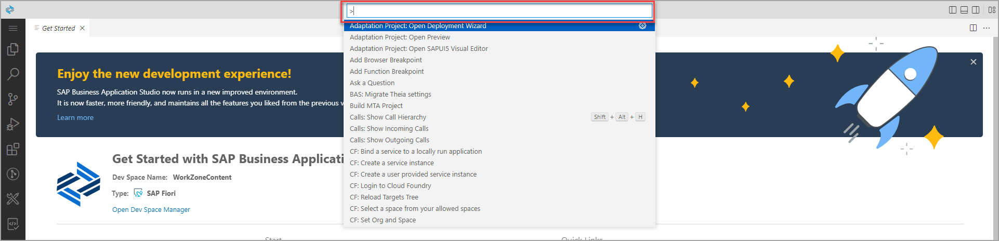
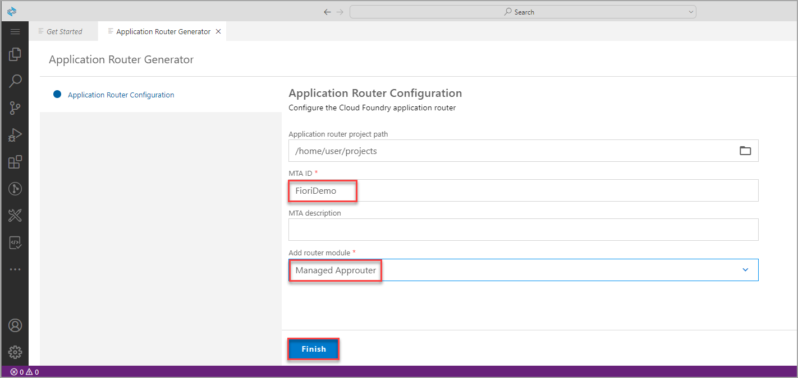
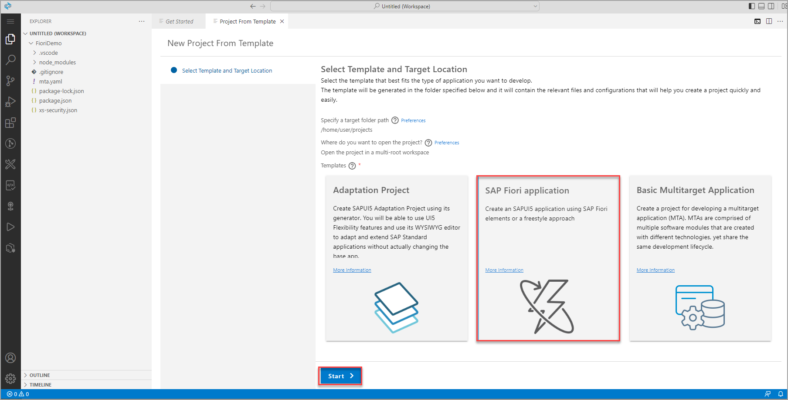
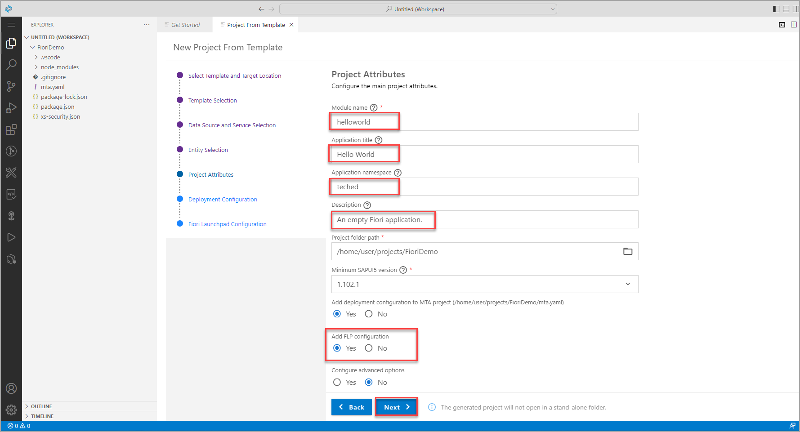
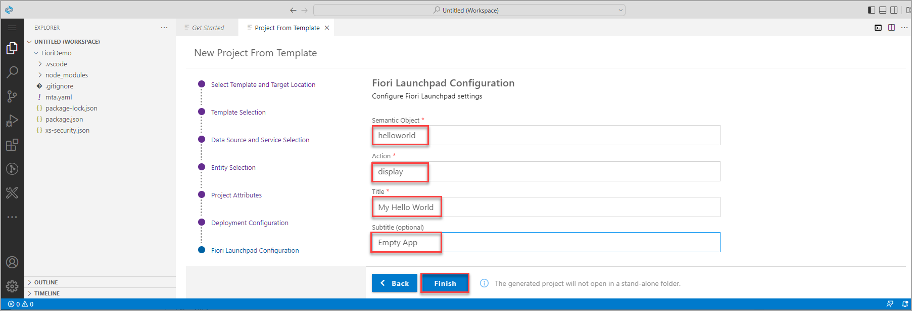
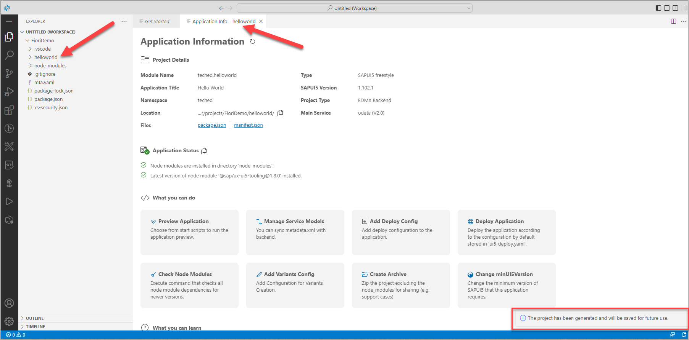

# Exercise 2.2 - Create an SAP Fiori App Using SAP Business Application Studio

In this exercise, you will develop a simple SAPUI5 freestyle application, adhering to SAP Fiori design guidelines. The flow consists of two parts:

1. Running a wizard that creates a multi-target application (MTA) project that is configured to use Managed Application Router. 

2. Creating an SAPUI5 app from a template within this project.

 

### Step 1: Create new Multitarget Application project

> An MTA is required in order to create the deployment artifact for SAP BTP, Cloud Foundry environment. If you are not familiar with the MTA concepts, read this [guide](https://www.sap.com/documents/2016/06/e2f618e4-757c-0010-82c7-eda71af511fa.html). Creating the MTA project upfront does not take long and will allow you to save time later in the exercise.

The search window on top of the page gives you easy access to search across your files. It also allows you to search for commands. 

1. Enter **>** into the Search window to search for a command. 

> You could also access the command palette via the **menu** icon on the top left of the screen and **View > Command Palette** 

    

The command palette opens at the top-center of the SAP Business Application Studio window.

3. Type `fiori: open` in the command palette text field to filter the commands and select the **Fiori: Open CF Application Router Generator** command.

    >Filter the list of commands in the command palette by typing part of the command in the command palette text field.

    

4. The **Application Router Generator Wizard** tab is opened. For **Application Router Configuration**, select the following, and click **Finish**.

    | Step | Parameter | Value |
    |:-----|:----------|:------|
    | A | Application router project path | **/home/user/projects** (default) |
    | B | MTA ID | **`FioriDemo`** |
    | C | MTA Description | Can be left empty (default) |
    | D | Add route module | **Managed Approuter** |

    

    >When end-users access an app in the Cloud Foundry environment, they actually access the Application Router first. The application router is used to serve static content, authenticate users, rewrite URLs, and forward or proxy requests to other micro services while propagating user information.

    >The recommendation is to use **Managed Application Router** that provides many benefits, when compared to Standalone Application Router, such as save resources, lower maintenance efforts, etc. Standalone Application Router should only be used in advanced cases, for example when application router extensibility is required. More information is available in [Developing HTML5 Applications in the Cloud Foundry Environment](https://help.sap.com/viewer/65de2977205c403bbc107264b8eccf4b/Cloud/en-US/11d77aa154f64c2e83cc9652a78bb985.html)

5. Wait until the creation of project is completed. A notification that "The files have been generated" appears at the bottom right of the screen.

    

 

### Step 2: Add the project folder to a workspace

Your workspace is an entity containing your project's settings, debug configurations, and task configurations. In SAP Business Application Studio, a workspace is created for you as part of the Project Creation wizard. You can choose to create a new workspace or for each project, or you can set up a multi-root environment. You can find out more about **Workspaces** in the SAP Business Application Studio [documentation](https://help.sap.com/viewer/9d1db9835307451daa8c930fbd9ab264/Cloud/en-US/0919ce1ca4a342628e49c0f5e9c8cdcf.html).

1. Click the **menu** icon in the upper left corner and select **File | Add Folder to Workspace...** to open the **Add Folder to Workspace** dialog.

    

2. The **Add Folder to Workspace** dialog is opened at the center of the SAP Business Application Studio window. Select **projects**.

    

5.   In the projects folder, select the **`FioriDemo`** project and click **OK**.

    

3. SAP Business Application Studio reloads with the `FioriDemo` project open in a yet untitled workspace. In the Explorer view you can see the `FioriDemo` project, its folder structure, and files.

    >The status bar color changes to blue, indicating that a workspace is open.

    

 

## Step 3: Create an SAPUI5 app from a template

Using the app creation wizard you can at any point click the Back button to go back to the previous step, or click a specific wizard step to go back to that step.

1. In the *Get Started* tab click **Start from template**.

2. Select the **SAP Fiori Application** tile, and click **Start**.

3. For *Template Selection* screen, select *Application Type* **SAPUI5 freestyle** from the drop-down, then select the template **SAPUI5 Appliction** and click **Next**.

4. In the *Data Source and Service Selection* screen, select **None** from the *Data Source* drop-down as for this simple app, you will not consume any data from a backend system. Then click **Next**.

5. In the next step, you can change the name of the view. You can simply keep View1 here and click **Next**.

6. For **Project Attributes**, select the following, and click **Next**.

    | Step | Parameter | Value |
    |:-----|:----------|:------|
    | A | Module name | **`helloworld`** |
    | B | Application title | **Hello World** |
    | C | Application namespace | **teched** |
    | D | Description | **An empty SAPUI5 freestyle app** |
    | E | Project folder path | **`/home/user/projects/FioriDemo`** (default)|
    | F | Minimum SAPUI5 version | **1.102.1** (default) |
    | G | Add deployment configuration | **Yes** (default)|
    | H | Add FLP configuration | **Yes** |
    | I | Configure advanced options | **No** (default) |

    
    
7. For **Deployment Configuration**, keep the defaults **Cloud Foundry** and *Destination Name* **None**. Click **Next**.

8. Finally, for **Fiori Launchpad Configuration**, select the following, and click **Finish**.

    | Step | Parameter | Value |
    |:-----|:----------|:------|
    | A | Semantic Object | **helloworld** |
    | B | Action | **display** |
    | B | Title | **My Hello World** |
    | B | Subtitle (optional) | Add a subtitle of your choice |

    

9. Wait until the installation of project dependencies is completed. This can take some minutes. A notification that "The project has been generated" appears at the bottom right of the screen, The **Application Info** tab is opened, and the files and project structure in the **Explorer** view are updated.
    
    

 

### Step 4: Run the App Locally in the Dev Space

To test your app, you can now run it locally within SAP Business Application Studio.

1.	Click the **Preview Application** tile on the Application Information.

    

    Different options how to preview the application are displayed below the search window at the top-center of the SAP Business Application Studio window.

2. Select the first option *start fiori...* which will open the new app in a sandbox launchpad shell.

    

3. A new browser tab opens showing the app. In this stage of the development, the app only shows a title.

> If the new tab does not open, this might be blocked in your browser. In this case, you will see a small message in the upper right corner with a link that you can click to allow pop-ups and new tabs opening.

    

 

## Summary

You've now created a simple app. In the next exercise you will build the app and deploy it to Cloud Foundry.

Continue to - [Exercise 2.3 - Build and Deploy your application ](../ex2.3/README.md)
