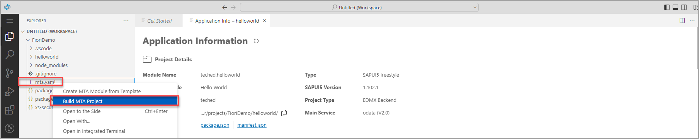
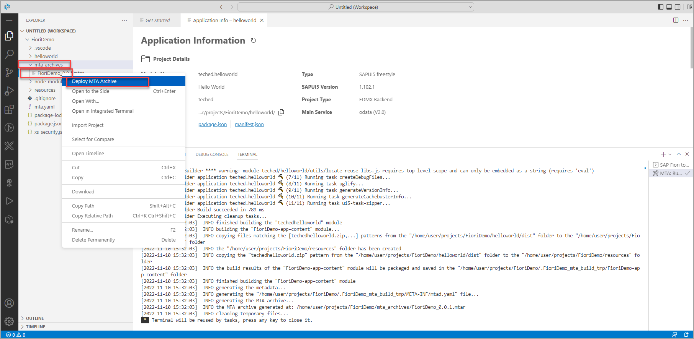
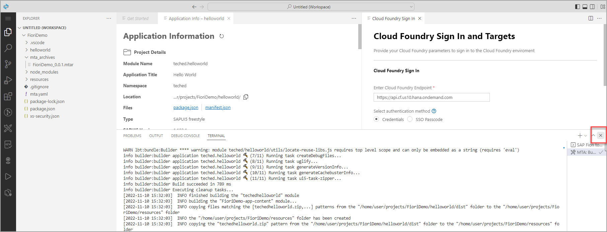
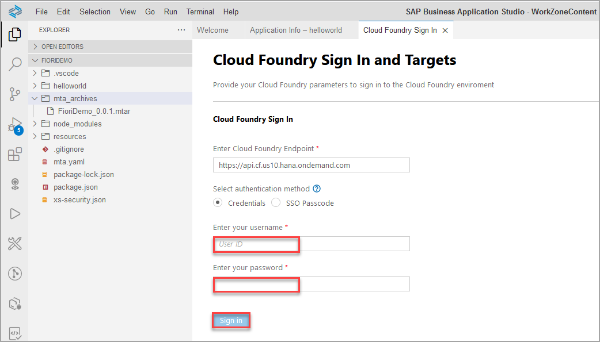
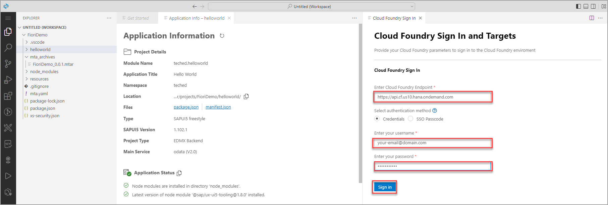
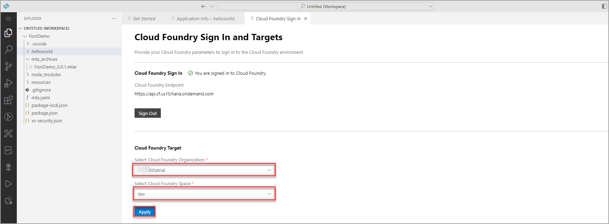
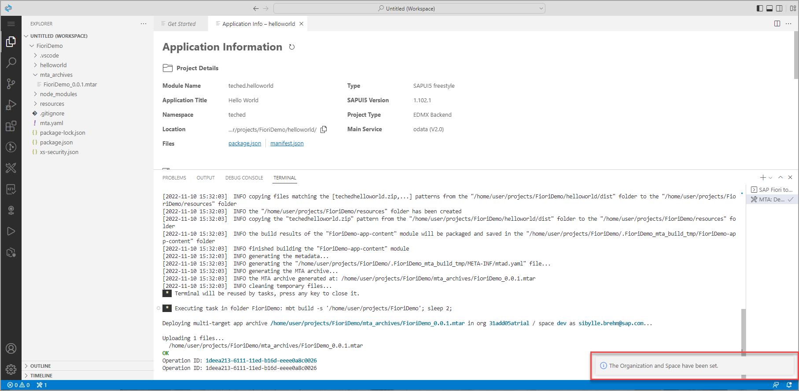
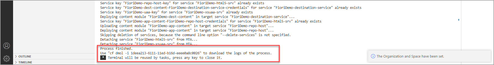
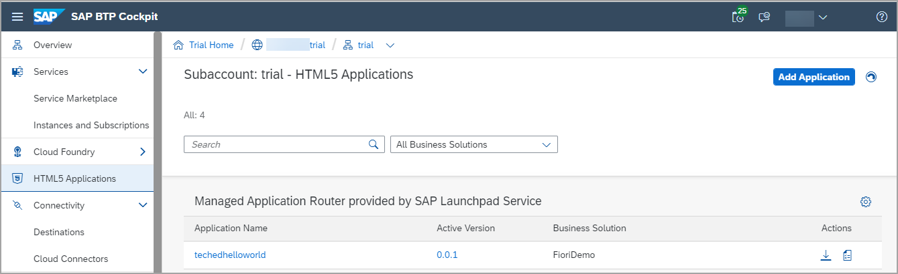

# Build and Deploy Your SAP Fiori App to SAP Business Technology Platform

In this exercise you will learn:
- how to build and deploy an application to SAP BTP, Cloud Foundry environment
- how to configure Cloud Foundry settings in SAP Business Application StudioBuild and deploy your SAP Fiori MTA project to your SAP BTP, Cloud Foundry environment.

 

### Step 1: Build the application

1. Go back to the tab with the **SAP Business Application Studio** open.

2. In the folder structure of your project on the left, right-click the `mta.yaml` file and select **Build MTA Project**.

> The build process creates a multi-target archive (`MTAR`) file in your project that packages all the project modules for deployment. 
> You can find the `MTAR` file in the `FioriDemo/mta_archives` folder.

 

### Step 2: Deploy your application to Cloud Foundry

1. Open the **mta_archives** folder, right-click the **FioriDemo_0_0_1.mtar** file and select **Deploy MTA Archive**.

> Before you deploy your new application, login to Cloud Foundry and select the target account to which you want to deploy the application. Therefore, a **Cloud Foundry Sign In** tab opens.

2. If necessary, close the *Terminal* to see the full Sign in tab.

3. Select the API endpoint, provide your credentials, and click **Sign in**.

    
    
    > If you are not sure which API endpoint, Cloud Foundry organization, and Cloud Foundry space is correct, you can find this information in the *Overview* screen of the SAP BTP Cockpit.
    > 
    > 

4. Select the Cloud Foundry organization, Cloud Foundry space, and click **Apply**.

    

    > A *The Organization and Space have been set* notification appears at the bottom-right of your screen and the deployment to the space you are connected to starts starts automatically. You can follow the deployment progress in the **Terminal** console at the bottom of your screen.

    

5. Wait for the deployment to complete.

    >The deployment process is usually quite fast. When the deployment process is complete, the notifications **Process finished.** and **Terminal will be reused by tasks.** will appear at the bottom of the **Terminal** console.

    > 

    >You can also find your deployed applications in the SAP BTP Cockpit in the HTML5 Applications area and launch them from there.
    >
    >

## Summary

With this, you have successfully completed the deployment of your SAP Fiori app to SAP BTP using SAP Business Application Studio.

Continue to - [Exercise 2.4 - Integrate Your SAPUI5 App into Your Site](../ex2.4/README.md)

