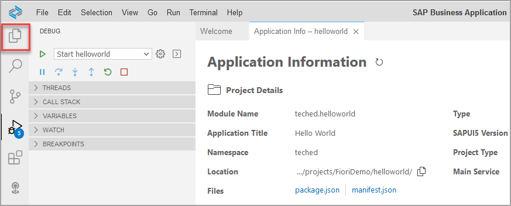
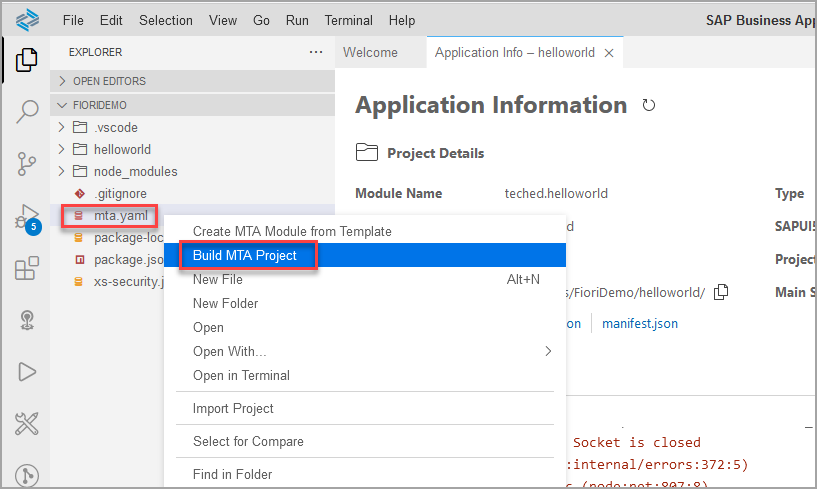
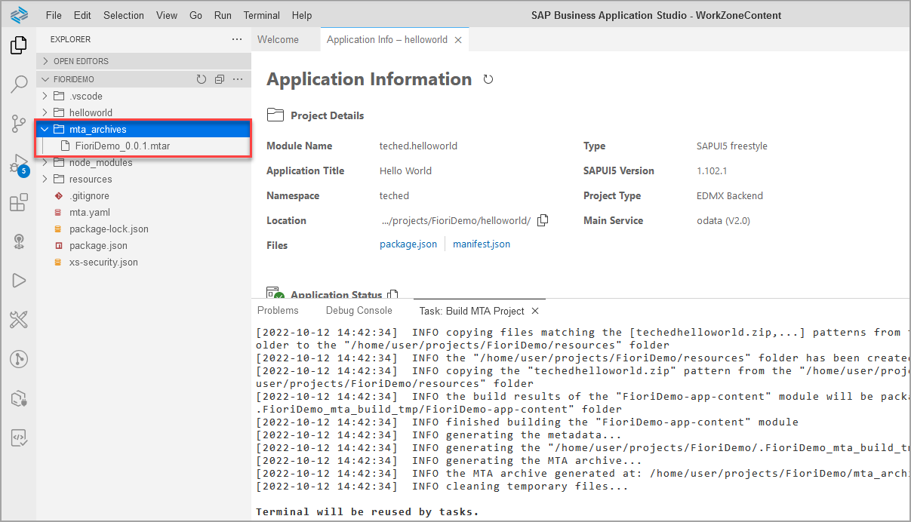
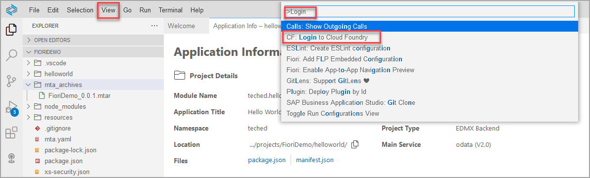
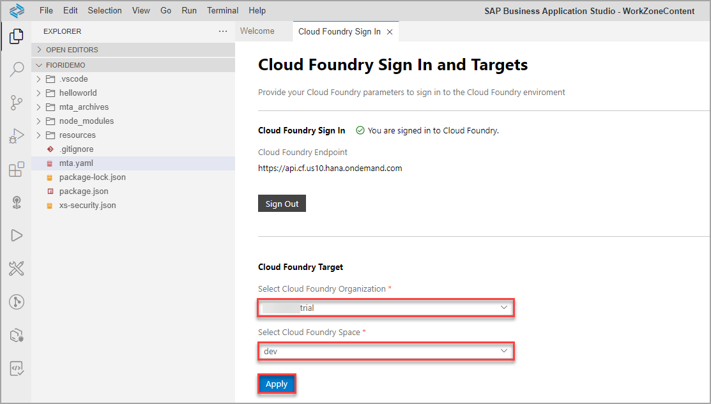
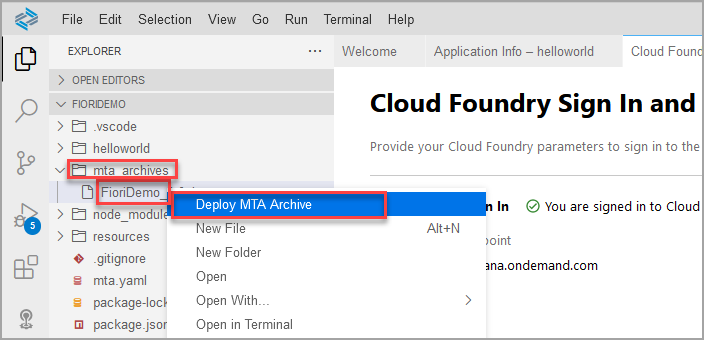
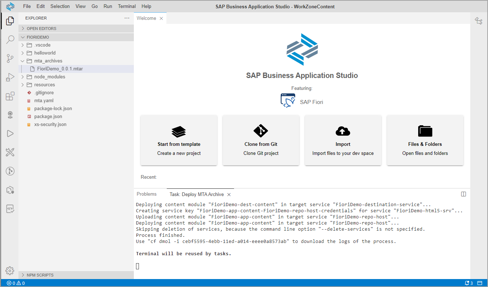

# Build and Deploy Your SAP Fiori App to SAP Business Technology Platform

In this exercise you will learn:
- how to build and deploy an application to SAP BTP, Cloud Foundry environment
- how to configure Cloud Foundry settings in SAP Business Application StudioBuild and deploy your SAP Fiori MTA project to your SAP BTP, Cloud Foundry environment.

 

### Step 1: Build the application

1. Go back to the **Explorer** pane.

2. Right-click the `mta.yaml` file and select **Build MTA Project**.

> You can collapse the *Open Editors* area for a better overview. 

> The build process creates a multi-target archive (`MTAR`) file in your project that packages all the project modules for deployment. 
> You can find the `MTAR` file in the `FioriDemo/mta_archives` folder.

 

### Step 2: Set Cloud Foundry preferences

Before you deploy your new application, login to Cloud Foundry and select the target account to which you want to deploy the application.

1. In the menu bar, select **View | Find Command** to open the **command palette**.

2. Select the command **CF: Login to cloud foundry**.

    > Type `login` to filter commands.

    

3. A **Cloud Foundry Sign In** tab opens in SAP Business Application Studio. Select the API endpoint, provide your credentials, and click **Sign in**.

    

4. Select the Cloud Foundry organization, Cloud Foundry space, and click **Apply**.

    

    > A *The Organization and Space have been set* notification appears at the bottom-right of your screen.

 

### Step 3: Deploy your application to SAP BTP, Cloud Foundry environment

1. Right-click the `mtar` file and select **Deploy MTA Archive**.

    

    >The application deployment to the space you are connected to starts and a notification appears. You can follow the deployment progress in the **Task: Deploy** console at the bottom of your screen.

3. Wait for the deployment to complete.

    >The deployment process can take 1-2 minutes. When the deployment process is complete, the notifications **Process finished.** and **Terminal will be reused by tasks.** will appear at the bottom of the **Task: Deploy** console.

    > 

    >You can also find your deployed applications in the SAP BTP Cockpit in the HTML5 Applications area and launch them from there.
    >
    >

## Summary

With this, you have successfully completed the deployment of your SAP Fiori app to SAP BTP using SAP Business Application Studio.

Continue to - [Exercise 2.4 - Integrate Your SAPUI5 App into Your Site](../ex2.4/README.md)

