# Integrate Your SAPUI5 App into Your Launchpad Site

In this exercise, you will learn how to a custom-developed SAPUI5 app that has been deployed to SAP BTP, Cloud Foundry environment to your site.

## Prerequisites
 - You've already created the `JobCore` launchpad site.
 - You've deployed your SAPUI5 app (including the navigation properties), to SAP BTP, Cloud Foundry environment.

Once you've deployed your SAPUI5 app to SAP BTP, it becomes available to add to your launchpad site.

 

### Step 1: Fetch updated content using the Provider Manager

1. Go back to the Administration environment of SAP Build Work Zone, standard edition.

2. Click the **Channel Manager** icon to view any available content channels. In this screen, administrators can create content channels, e.g. to consume federated content from a provider system like SAP S/4HANA.

    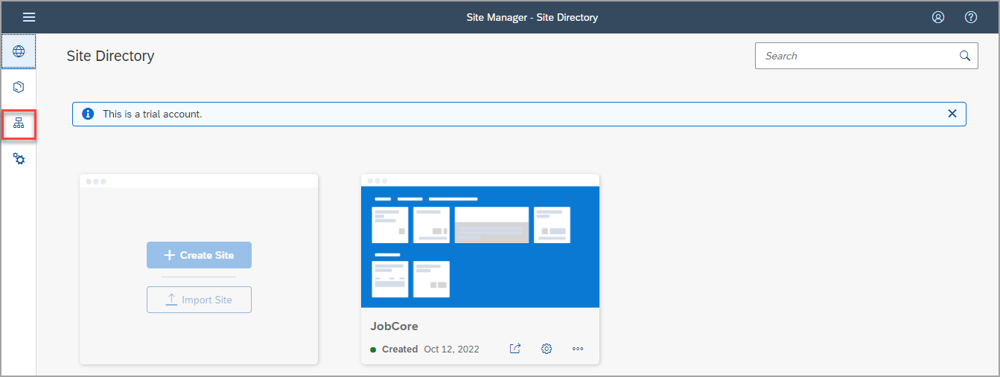

3. In the **HTML5 Apps** row, click the **Update content** icon to consume any newly deployed apps for integration. You will see a message that the content is being updated. Wait till the status is set to **Updated**.

    >The **HTML5 Apps** content channel is available by default out of the box. Any app using the managed app router that you deploy to SAP BTP is automatically added as content to this channel.

    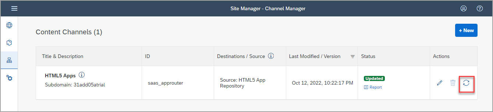

 

### Step 2: Add your deployed SAPUI5 app to your content

1. Click the Content Manager icon in the side panel to open the **Content Manager**.

    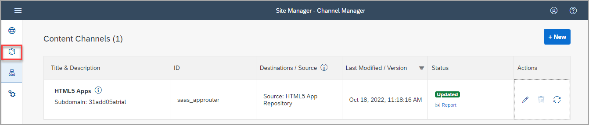

    >The **Content Manager** has two tabs: **My Content** where you can manually configure content items and view any other available content items, and the **Content Explorer** where you can explore exposed content from available content channels, select the content, and add it to your own content.

2. Click the **Content Explorer** tab to explore content from the available content providers.

    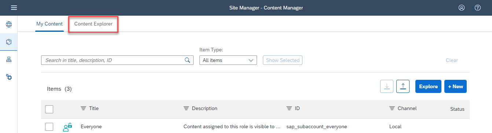

3. Select the **HTML5 Apps** provider.

    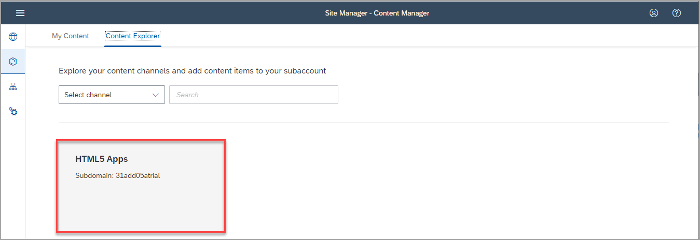

4. You'll see that your `Hello World` app that you've just created in SAP Business Application Studio, already exists in this provider. Select it and click **+ Add to My Content**.

    !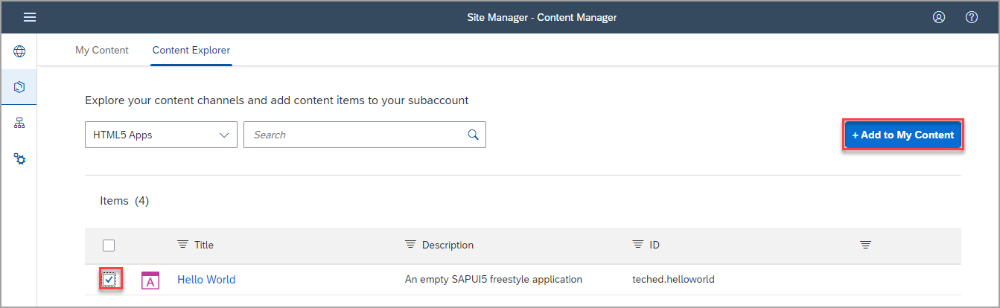

5. Click the **My Content** tab.

    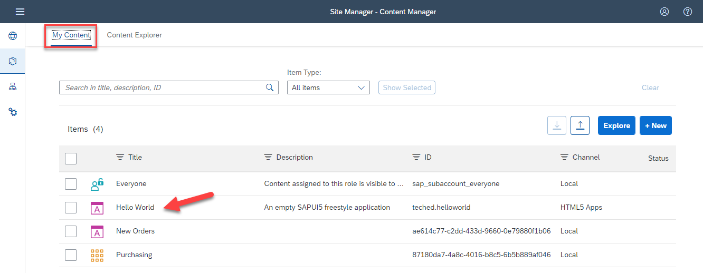

    Note that your `Hello World` app is in the list of content items.

 

### Step 3: Create group and assign app to it

In this step, you'll create a new group and assign the `Hello World` app to it.

1. Click **+ New** in the **Content Manager** and select **Group** to create a new group.

    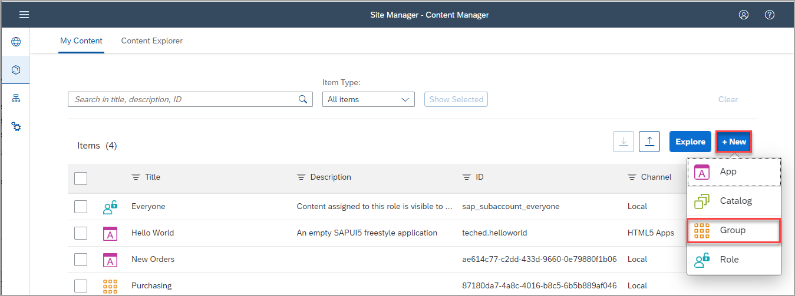

2. Enter `Simple Apps` as the **Title**.

3. In the **Assignments** panel on the right, click in the search box to see a list of apps.

    >If you have many apps, you can type some letters of your app name in the search bar, (for example, `he`) to search for the app.

4. Next to the `Hello World` app, click the **+** icon to assign your app to this group.

    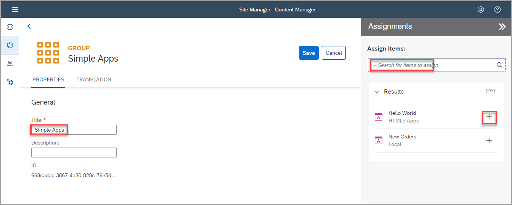

    You'll see that the icon changes.

4. Click **Save**.

    

 

### Step 4: Assign app to Everyone role

In this step, you'll assign the `Hello World` app to the `Everyone` role. This is a default role - content assigned to the `Everyone` role is visible to all users. In addition, the `Everyone` role is by default assigned to every site, so that it is not necessary to assign this role to your site to make its content available.

1. Click the back icon to go back to the **Content Manager**.

    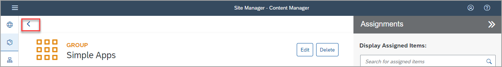

2. Click the `Everyone` role to open the role editor.

    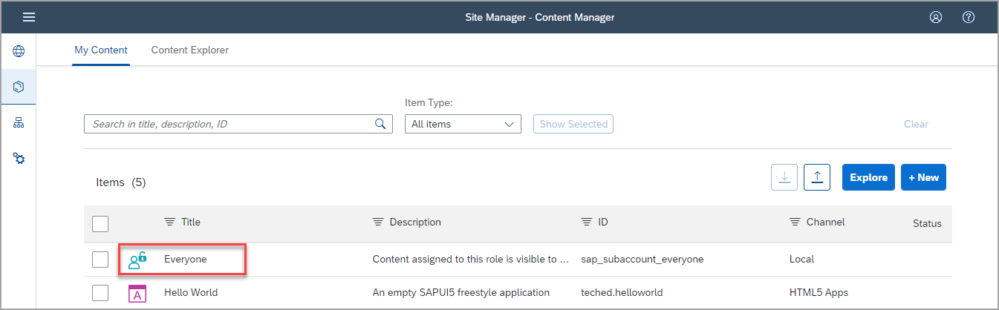

3. Click **Edit**.

    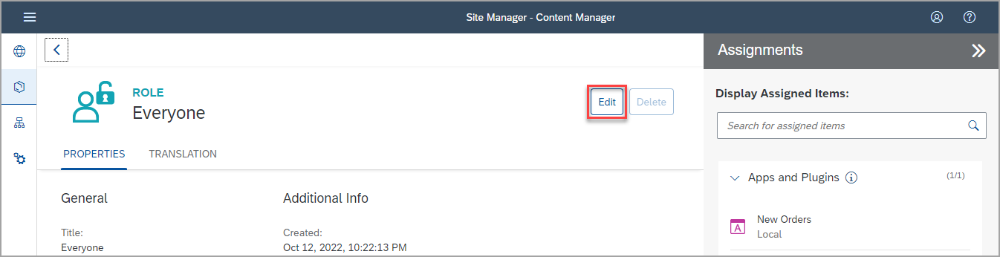

4. Click the search box in the **Assignments** panel on the right. Any available apps are shown in the list below.

5. Next to the `Hello World` app, click the **+** icon. You'll see that the icon changes.

6. Click **Save**.

    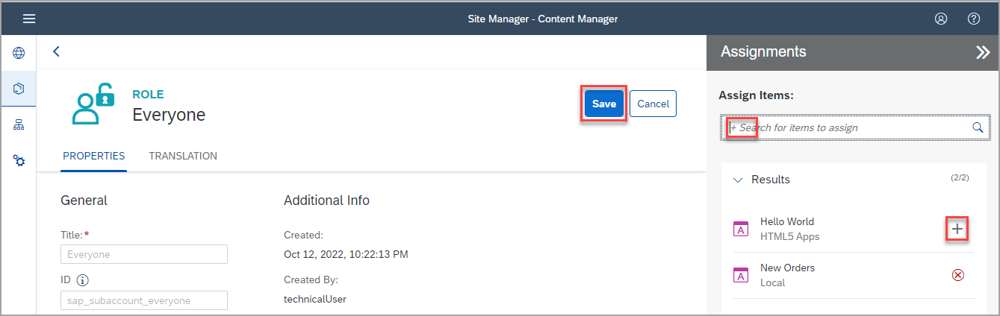

 

### Step 5: Review your site

1. Click the **Site Directory** icon to open the Site Directory.

    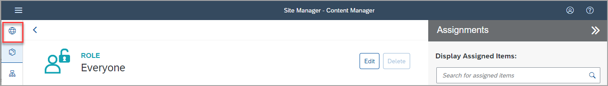

2. Click the **Go to site** icon on the site tile. The site opens in a new browser tab.

    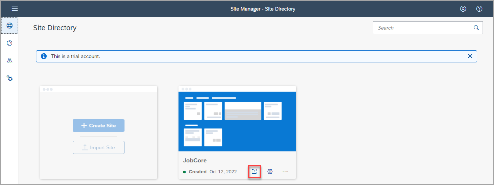

    You will see both apps that you have created in your site. In the `Simple Apps` group, you will see the `Hello World` app that you just created.

    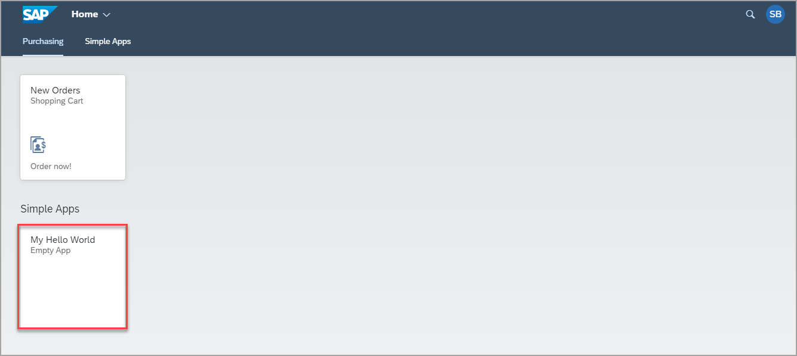

3. Click the app to launch it. You see an empty app showing just its title `Hello World`.

    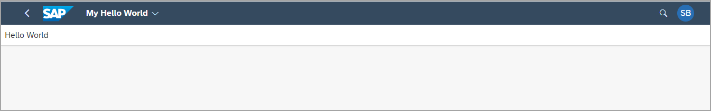

 

## Summary

With this, you have successfully added your SAP Fiori app to your SAP Build Work Zone site.

Continue to - [Exercise 3 - Access your site with SAP Mobile Start](../../ex3/README.md)

