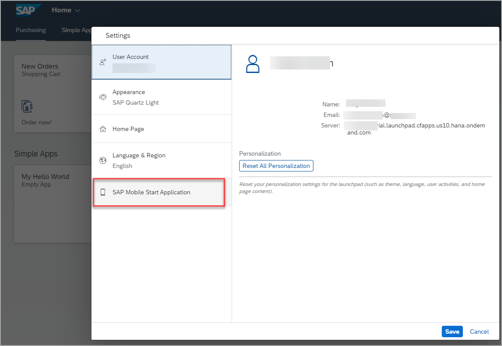

# Exercise 3: Access Your Site with SAP Mobile Start

In this exercise, you will learn how to connect the SAP Mobile Start native app with your site. 

 

### Step 1: Enable SAP Mobile Start in Site Settings

1.  Go back to the Site Directory. 

3.  Click the settings icon on the 'JobCore' tile to open the Site Settings.

    

2.  Within the Site Settings make sure that SAP Mobile Start is enabled.

    

3.  If it is not, click edit, set the SAP Mobile Start toggle to **YES**, then click **Save**.

4. Get back to Site Directory using the back icon .

 

### Step 2: Access QR-Codes in the User Settings

1.  Open your Site via the **Go to site** icon on the **JobCore* tile.

    

2.  On the site, open the user menu via the user initials on the top right. Then choose **Settings**.

    

3.  In the Settings screen, choose the **SAP Mobile Start Application** tab.

    

    (If the option is not available make sure SAP Mobile Start is enabled in the Site Settings (Step 1), also refreshing the site might be required for your changes to become active.)

    In this screen you can select your type of device (Android or iOS) and switch between two QR Codes via the toggle button:

      1. **Install**:
      This QR-Code can be used to install the SAP Mobile Start app on your device. It's a direct link to the Apple app store page.

      2. **Register**:
      This QR-Code is used later within the SAP Mobile Start app to register it to your site.

    

>It is also possible to have SAP Mobile Start deployed via Mobile Device Management. With that, a specific site can be preconfigured and no QR-Code registration is needed.

 

### Step 3: Install SAP Mobile Start on your mobile device

Use the Install QR-Code from Step 2 to install SAP Mobile Start on your Mobile Device. Alternatively, you can search for SAP Mobile Start in the respective App Stores.

 

### Step 4: Onboard SAP Mobile Start

1.	Use the toggle in the *SAP Mobile Start Application* settings to switch to the **Register** QR-code. Scroll down if required.

2. Open the SAP Start app on your mobile device, press the **Scan** button and make sure to allow camera access.

    (Below the scan button you will find the option to enter the demo mode. This will demonstrate how a fully configured launchpad site with the addition of SAP Task Center looks like.)

2.	Next, use your device camera to scan the **Register QR-Code** in the launchpad user settings. If the scan succeeded, you can continue with the onboarding process.

    

3.  Follow the guided onboarding process within the app:

  - Log in with your user

  - Accept the End User License Agreement and Data Privacy Statement

  -	Depending on your setup you might need to create a passcode / allow biometric authentication.

    After completing the onboarding process, you will be directed to the initial **Start** screen.

 

### Step 5: Try the App

1.	You can use the navigation icons on the bottom the move between the Start and the Application screen. The Start screen offers an overview for quick access to your most used apps. The Application screen lists all groups and apps of the site. If you set up SAP Task Center integration in your site, you will see an additional icon **To Do** on the bottom where you can find all your workflow items.

2.  Both screens the Start & Application screen have the notification icon and the user (settings) icon. Use them to access the notification section or the Profile and Settings page.

3.  Within the Application screen you can use the search bar to find specific applications.

4.  You can click on app tiles to open your application of choice.

5.	From the profile and settings you can choose **Sign Out** to return to the initial onboarding screen, in case you want to connect to a different site.

## Summary

### Congratulations! You have successfully completed this end-to-end workshop for configuring SAP Build Work Zone, standard edition!

If you want to learn more about SAP Build Work Zone, please visit the [SAP Build Work Zone community page](https://community.sap.com/topics/mobile-experience/start). More Information about SAP Mobile Start is available at the [SAP Mobile Start community page](https://community.sap.com/topics/mobile-experience/start).

Go back to the [main document](../../README.md).
