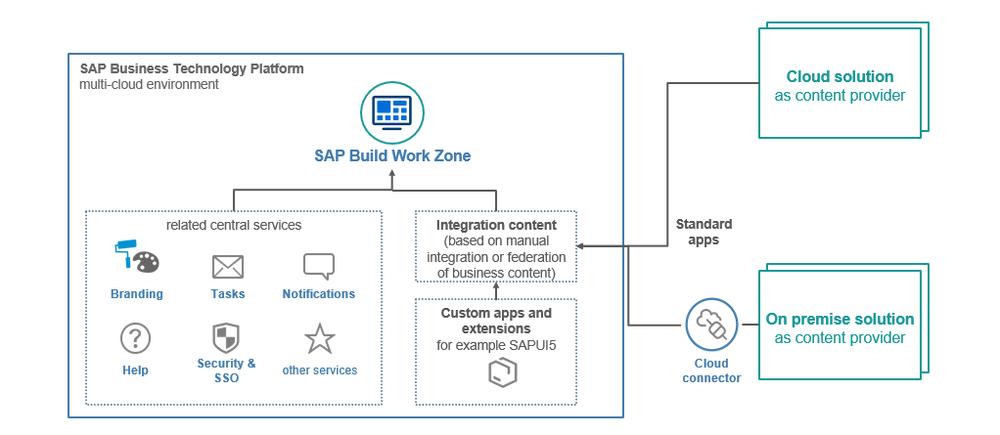
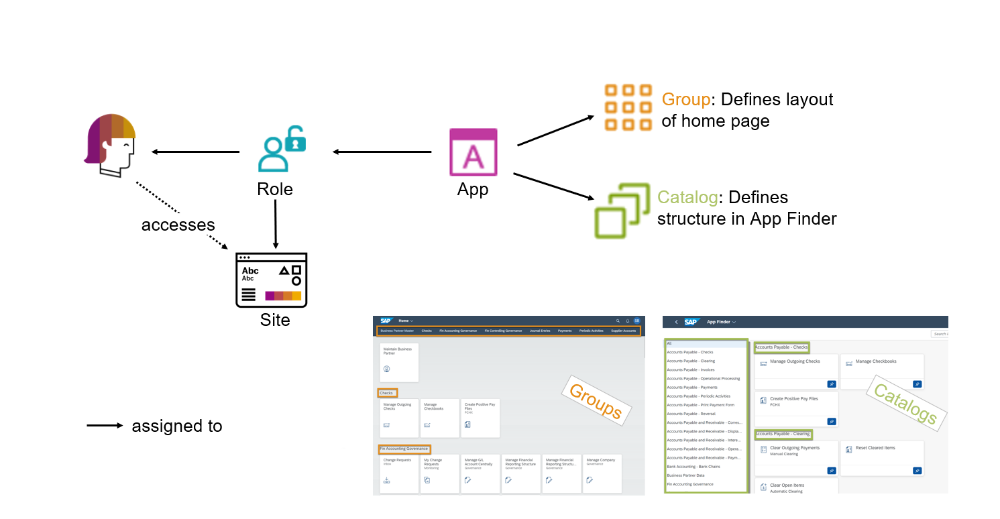

# Get to know the admin environment of SAP Build Work Zone, standard edition (formerly known as SAP Launchpad service)

## High-level architecture

When integrating content from different cloud and on-premise solutions into a central entry point built with SAP BUild Work Zone, it is important to understand that the integrated systems continue to run independently from SAP Build Work Zone with their own life-cycle, administration, and updates. We call those systems content providers. Applications are integrated into the SAP Work Zone site using iFrames, so different apps with different SAPUI5 versions can run in the same site. This integration works in the same way for SAP Build Work Zone standard and advanced. Besides content from cloud and on-premise solutions, custom applications deployed on SAP BTP can be easily integrated. 

While SAP Build Work Zone takes care of rendering the site with its content, the roles-based access and the navigation from app to app, other services from the SAP Business Technolgy Platform are leveraged to provide users with a complete experience, e.g. UI Theme Designer for branding your site, SAP Task Manager as a central inbox for all business tasks and SAP BTP security services for Single Sign-on. 

## Understanding content entities

Let's take a look how the content entities relate to each other. In SAP Build Work Zone Content is created separately from sites and assigned to the sites via roles. When users access sites, they only see the content they are entitled to see by the roles that were assigned to them. On the other side, apps are assigned to roles. The role gives all its assigned users the permission to access all assigned apps. This does not yet mean that the app will be displayed on the home page - it might also be available via the search or via the App Finder. Display on the home page is handled via group assignment: Apps that are assinged to a group are shown on the home page, but users can add or remove apps from the home page as part of their personalization. Finally, apps can also be assigned to catalogs to make then available in the App Finder. 

## Key Tools for SAP Build Work Zone, standard edition administration

In SAP Build Work Zone sites and content are managed separately to allow for re-use of content in several sites. 

In the **Site Directory**, administrators can create and delete sites, export and import sites, access existing sites and open the sites for editing.
In the **Site Editor**, administrator can adapt a large number of site settings to configure user capabilities (like personalization, language selection...) and various general or display related properties of the site. In addition, they can assign roles to the site.
The **Content Manager** manages cross-site content and consists of two areas: The *My Content* area with an overview of all available content entities and access to the respective editors and the *Content Explorer* where administrators can explore federated content from provider systems and add content items to the My Content area.
In the **Channel Manager**, administrators can add, update and delete connections to content providers for federated content.
Finally, in the **Settings**, integration with central services, like notifications or the SAP Identity Provisioning service can be configured. In addition, administrators can access error logs and further configurations here. 

## Summary

The administration tools enable administrators both to create local content entities (like apps, groups, and roles) and to add federated content from content provider systems to SAP Build Work Zone sites. Go back to [main exercise document](../README.md).
