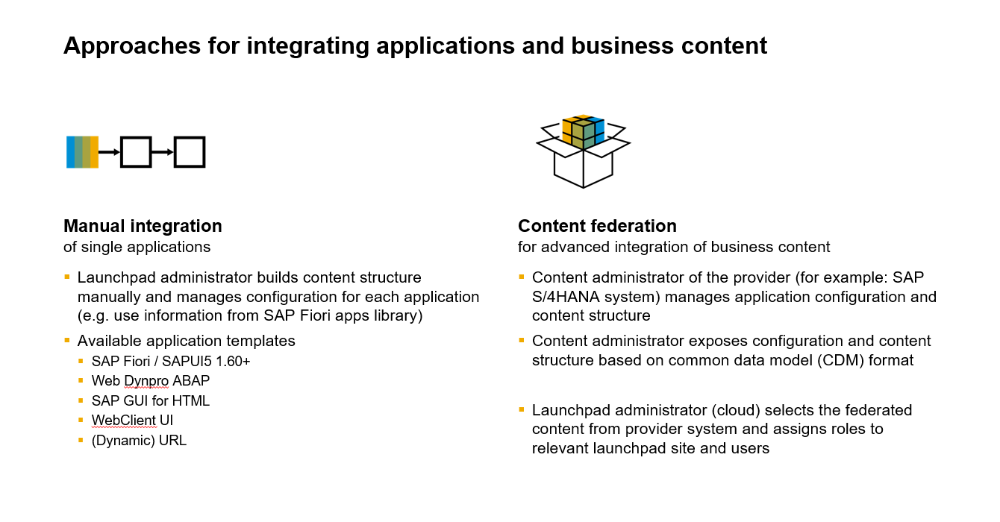
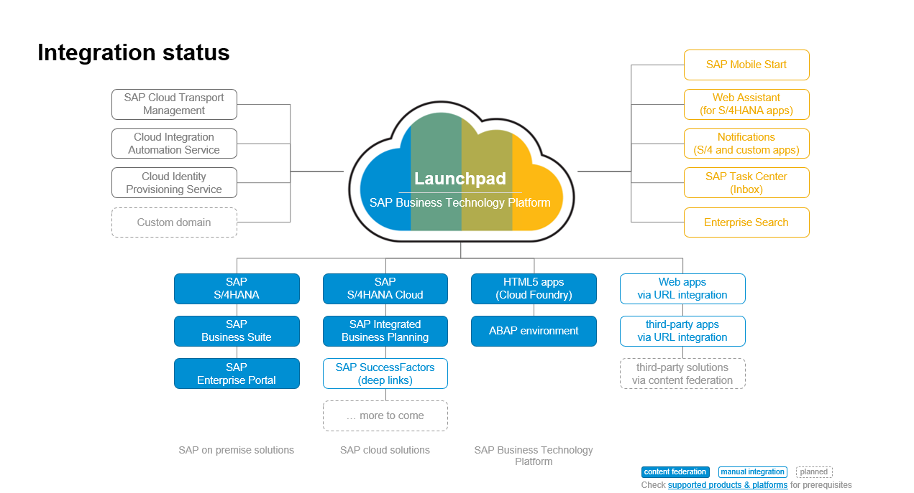

# Integrating Business Content with Content federation

## Approaches for integrating business content

There are two ways for integrating business content: You can either create applications manually using the tools described in the administration section or consume large amounts of content in a more efficient way with content federation. To do so, content administrators on provider side (e.g. in the S/4HANA system) need to configure the applications and the content structure and then select the roles that should be exposed to SAP Build Work Zone. The exposure translates the exposure scope, consisting of all apps, groups, catalogs, spaces and pages related to the selected roles, to the Common Data Model (CDM) format. The Work Zone administrator sets up connectivity with the provider system, selects the content from the provider system and manages role assignments to users and sites.

## Integration status

Content federation is currently supported for SAP S/4HANA cloud and on-premise systems, for SAP Business Suite systems, SAP Integrated Business Planning, SAP Enterprise Portal, HTML5 apps deployed in the same BTP subaccount, and the SAP BTP ABAP environment. In addition, you can find the current integration status for central services and for manual integration in the following picture.

## Summary

Content federation enables administrators to easily integrate large amounts of business content that were configured on the provider system. Go back to [main exercise document](../README.md).

