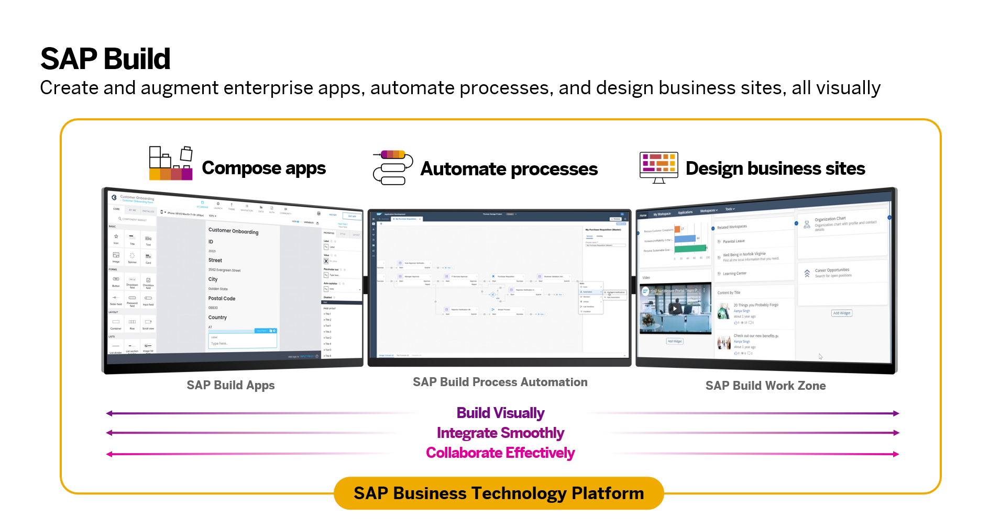
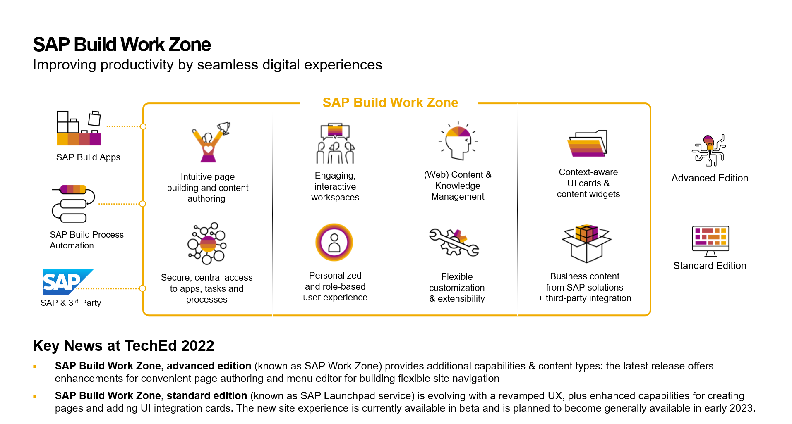
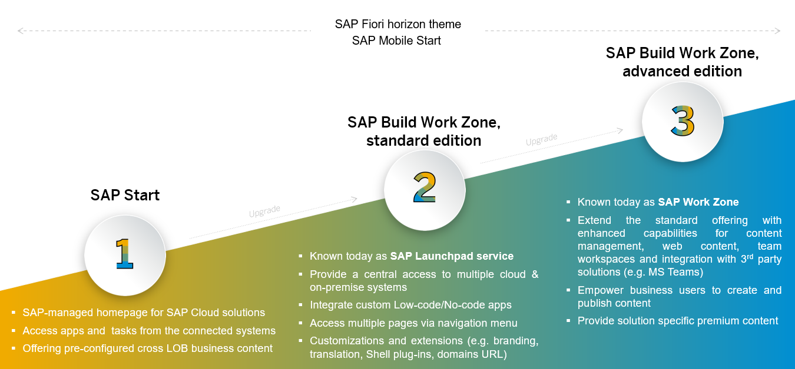

# Get to know SAP Build Work Zone, standard edition (formerly known as SAP Launchpad service)

## Understanding SAP Build

SAP Build brings together SAP Build Apps (formerly SAP AppGyver), SAP Build Process Automation (formerly SAP Process Automation), and SAP Build Work Zone (formerly SAP Work Zone) into a unified development experience with new innovations to rapidly build apps, automate processes and create business websites.

The SAP Build portfolio combines our low code solutions which enable users of all skill levels to easily create and augment business applications. The unified low-code solution portfolio empowers users to create applications, automate tedious processes, and design engaging business sites with drag-and-drop simplicity.

Pro-developers and line-of-business developers can 
- build visually with drag-and-drop simplicity and libraries of prebuilt business content
- integrate smoothly with SAP and non-SAP systems and leverage hundreds of prebuilt processes, bots and UX components
- collaborate effectively bringing together business and developers to work in fusion teams.

## SAP Build Work Zone

SAP Build Work Zone provides users with a central access to SAP and custom-built apps & extensions, as well as third-party solutions (cloud / on-premise) in a personalized, role-based user experience with search, tasks, notifications, cards, micro-experiences, and more. 

SAP Build Work Zone comes in two editions, standard and advanced. While the standard edition focuses on application integration and an administrator provided central entry point, the advanced edition allows customers to build an engaging digital workplace & employee portal experience blending business data with unstructured information (docs, news, video, etc.). In addition, it empowers business users with self-services for information sharing & enablement (knowledge base, forum, wiki).

SAP Build Work Zone further enhances our low-code/no-code capabilities at the UX layer as it provides users with a consumption channel for workflows, apps, and services. It allows for no-code personalization and page/portal building.

## Modular Offering for SAP's Central Entry Point

As part of the new SAP Build brand, SAP now provides a modular offering to establish a central entry point to the business landscape.

- SAP Start offers an SAP-managed home page to SAP Cloud solutions free of charge. Users can access pre-configured applications and tasks from connected systems across LOBs
- SAP Build Work Zone, standard edition (formerly known as SAP Launchpad service) provides a central access to apps, tasks, and processes from multiple cloud and on-premise systems. It integrates custom applications with SAP standard applications and allows for extensions and customization, e.g. custom theming. Major enhancements are planned in the area of navigation (pages, workspace), visualization (UI Integration Cards), page building and pre-packaged content delivery.
- SAP Build Work Zone, advanced edition (formerly known as SAP Work Zone) extends the standard offering with enhanced capabilities for content management, web content, team workspaces and integration with 3rd party solutions (e.g. MS Teams). It also empower business users to create and publish content. Major enhancements are planned in the area of integration with business applications (notifications, task center, etc.), menu building, and a simplied upgrade from the standard edition.

## Summary

SAP provides a tailered central entry point offering that caters for different customer requirements: SAP Start and SAP Build Work Zone, standard and advanced editions. You can now get started with the workshop exercise. 
Go back to [main exercise document](../README.md).
